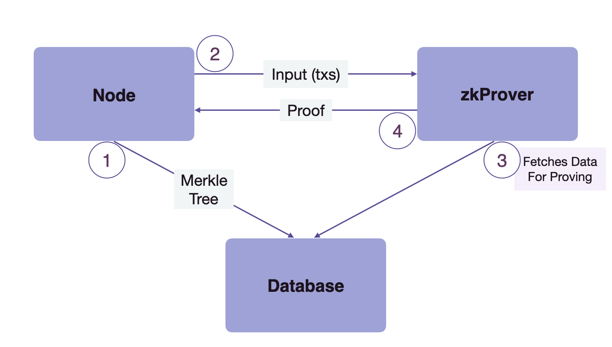

## Concept

Polygon zkEVM is an execution layer 2 that can process a batch of EVM transactions and generate a zero knowledge proof that efficiently proves the correctness of the execution.

The decision of proving EVM transactions instead of creating a virtual machine with  simpler transactions is for minimizing the friction of current Ethereum users and dApps when using the solution. It is an approach that requires the recreation of all the EVM opcodes, which
allows the transparent deployment of any existing Ethereum smart contract. 
For this purpose, a new set of technologies and tools have been engineered and developed and, they are briefly presented below.

## EVM Arithmetization

The first step to prove the execution correctness of an EVM transaction is to build a suitable execution trace. By a suitable execution trace, we mean a set of values that fulfill the constraints imposed by the EVM processing. The trace is expressed as a matrix, where each column has a name. Each column is interpolated into a polynomial and the correctness of the execution is finally reduced to verifying a set of identities between polynomials (columns).
The process of designing the proper set of columns and identities is called arithmetization. The Polygon zkEVM provides an efficient arithmetization of the EVM.

<!-- TODO. We could do a picture of the matrix -->

## Executor, zkASM and zkProver

The task of creating the execution trace is performed by a component called the **executor**.
The executor takes as inputs the transactions of a batch, a ChainID, the root 
of a Merkle tree representing the previous state of the zkEVM in that chain and
the root of the new state after executing the transactions. 
Additionally, the executor gets values 
of the current state of the zkEVM to build the proof.

The executor is in fact an interpreter of an assembly language
called zkASM. 
The zkASM language is used to build a program called zkROM that 
when executed by the Executor provides a suitable execution trace.
In the zkROM program, each EVM opcode is implemented with a
set of zkASM instructions. 
Each instruction utilizes a row of the execution trace matrix, 
also known as a "step" of the zkEVM. 

The executor is part of the **zkProver**, which is the
core component of the Polygon zkEVM.
The following figure shows, at a high level, the interaction of the zkProver with the other components of the solution, which are the Node and the Database (DB):

1. The Node sends the content of the Ethereum state and the EVM Merkle trees to the DB, to be stored there. 

2. The Node sends the input batch of transactions to the zkProver. 

3. The zkProver accesses the DB, fetching the information it needs to produce verifiable proofs of the transaction batch sent by the Node. 

4. The zkProver generates the proofs of transactions, and sends these proofs back to the Node. 

## Polynomial Identity Language (PIL)

The Polynomial Identity Language (PIL) is a novel domain-specific language
for defining the constraints of the execution trace of state machines. 
It is used to define the name of the polynomials of the execution trace and, to describe the identities or relationships that these polynomials must fulfill to consider an execution as correct.

## Modular Design

The amount of columns and identities can grow beyond thousands 
for the execution trace of complex state machines like the EVM.
Managing such a huge matrix makes its design complex and hard to handle.

To simplify this, the Polygon zkEVM uses a divide and conquer technique
in which the execution trace is split in smaller matrices.
Then, using a proving technique called plookup, it is possible to 
relate rows in one matrix with rows in another matrix.
In particular, we use inclusion and permutation.
Inclusion checks that the rows in a matrix are
included in another matrix.
Permutation checks that the rows of a matrix are the same 
rows of another matrix but in a different order.  

The PIL language allows to name the columns of each matrix in which the execution trace is divided (using the keyword $\mathtt{namespace}$) and, it also allows the definition of inclusions 
(using the keyword $\mathtt{in}$) and permutations (using the keyword $\mathtt{is}$). 

In the Polygon zkEVM, the execution trace is divided into a main matrix also called 
the **main state machine** and secondary matrices also called **secondary state machines**. 

## Further Reading

In the subsections following, simple examples of arithmetization are shown and,
the assembly and PIL languages are introduced. 
In posterior sections, the assembly, the PIL, and the secondary state machines are described in more detail.

We must stress that this documentation is still a **Work In Progress** (WIP). In particular, some aspects are more covered than others, some components still miss an explanation, some sections are going to be greatly extended and, some other sections might be reorganized.