[ToC]

# The Storage State Machine

The Storage State Machine (SM) is responsible for all operations on data stored in the zkProver's storage. It receives instructions from the Main State Machine, called ***Storage Actions***. These Storage Actions are typical database operations; Create, Read, Update and Delete (CRUD).

The Storage SM is in fact a micro-processor with the firm-ware and the hardware parts.

It is in the firmware part of the Storage SM where the logic and rules are set up, expressed in JSON format and stored in a ROM. A novel language, called the **zero-knowledge Assembly** (zkASM), has been developed by the team. It is a language especially designed to map instructions from the zkProver's Main SM to other state machines, in this case, to the Storage SM's Executor. The Main SM's instructions, or Storage Actions, are parsed to the Storage SM Executor for execution in compliance with the rules and logic specified in the JSON-file.

The hardware part uses another novel language, called **Polynomial Identity Language** (PIL), which is especially designed for the zkProver, because almost all state machines express computations in terms of polynomials. State transitions in state machines must satisfy computation-specific polynomial identities.

The Storage SM's Executor carries out all Storage Actions (executes these operations), and also generates committed and constant polynomials.

PIL codes, in the zkProver, are used to check correct execution of SM-specific Actions. They therefore take as inputs all committed and constant polynomials.

In order to achieve zero-knowledge, all data is stored in the form of Merkle Trees, which means the Storage SM often makes requests of another state machine, the [Poseidon SM](), to perform hashing (referred to as $\text{POSEIDON}$ Actions).

## About this Document

This document describes the Storage State Machine and the zkProver's Storage, which the Storage SM interacts with, by either reading or altering data stored in it. 

This document therefore entails; 

- The basic design of the zkProver's Storage and some preliminaries. i.e., How the Sparse Merkle Trees (SMTs) are built.
- Explanations of each of the [Basic Operations](#basic-operations-storage-actions) the Storage SM routinely performs.
- Specific parameters the Storage SM uses, such as, how keys and paths are created, and the two $\text{POSEIDON}$ Hashes used in the SMTs.
- As well as, the three main source-codes the Storage SM needs to function effectively. That is, 
  - the Storage Assembly code, 
  - the Storage Executor (both in C and JavaScript), and 
  - the PIL code, for all the polynomial constraints and proving correctness of execution.

## Introduction

A generic state machine is characterised by; sets of states (as inputs) stored in registers, instructions to how the states should transition, and the resultant states (as outputs) stored as new values in the same registers. See Figure 1 below, for a standard state machine.

A state machine can be monolithic, where it is a prototype of one particular computation, while others may specialise with certain types of computations. Depending on the computational algorithm, a state machine may have to run through a number of state transitions before producing the desired output. Iterations of the same sequence of operations may be required, to the extend that most common state machines are cyclic by nature.

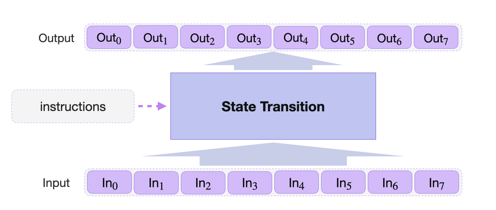

<b> Figure 1: A Generic State Machine </b>

The Storage SM performs computations on the key-value data stored in special Merkle Trees, called **Sparse Merkle Trees** (SMTs). The basic operations it executes are; CREATE, READ, UPDATE and DELETE.

In the Storage SM, keys and values are strings of 256 bits and, for convenience, can be interpreted as 256-bit unsigned integers 

The mechanics of the Storage SM and its basic operations are described in detail later in this document. For now, an example of the UPDATE Operation is given in order to illustrate the various components involved.

 

### Example. An UPDATE Operation

Suppose the Main SM instructs the Storage SM to UPDATE a value $V_{\mathbf{old}}$, associated with a given key $K_{\mathbf{0123}}$ and stored in a binary SMT, to a new value $V_{\mathbf{01..7}}$. 

The Main SM must then provide, with its request, all data the Storage SM needs in order to correctly update the value $V_{\mathbf{old}}$. That is; the root of the SMT, the key-bits for navigation to the leaf, the Remaining Key, the leaf level, the old value and the new value, and all relevant siblings.

Typically, the Storage SM Executor has to first navigate the tree to the leaf storing the value $V_{\mathbf{old}}$. Once the value is located, the Storage SM Executor will then do following three things, simultaneously; 

1. Reconstructs the corresponding key, $K_{\mathbf{0123}}$, from both the remaining key found at the leaf and key-bits used to navigate to the leaf.
2. Ascertains that indeed the old value, $V_{\mathbf{old}}$, was included in the old root,
3. Carries out the UPDATE of the value $V_{\mathbf{old}}$ and all nodes along the path from the leaf to the root. 

For the sake of brevity, this illustration focuses on step 3, just the UPDATE part. That is, supposing that the leaf that stores the value $V_{\mathbf{01..7}}$ is found, and $V_{\mathbf{01..7}}$ was indeed included in computing the old root.

The task therefore, is to update the value and all the node values along the path from the leaf to the root, including the root. In other words, compute the new root from the new value and its given siblings.

Here's how the Storage SM does this,

*Step 1.* Computes the hash of the new value, 
$V_{\mathbf{01..7}} = \big( V_{\mathbf{0}}, V_{\mathbf{1}}, V_{\mathbf{2}}, V_{\mathbf{3}}, V_{\mathbf{4}}, V_{\mathbf{5}}, V_{\mathbf{6}}, V_{\mathbf{7}} \big)$
 call it the *Committed Value*; resulting in the hashed value,
    
\begin{aligned}
   \text{HV}_{\mathbf{0123}} = \big( \text{HV}_{\mathbf{0}}, \text{HV}_{\mathbf{1}}, \text{HV}_{\mathbf{2}}, \text{HV}_{\mathbf{3}} \big) = \text{Hash}\big( 0000\|V_{\mathbf{01..7}} \big).
\end{aligned} 

*Step 2.* Form the leaf by computing the hash of the concatenation of the remaining key $\text{RK}_{\mathbf{0123}} = \big( \text{RK}_{\mathbf{0}}, \text{RK}_{\mathbf{1}}, \text{RK}_{\mathbf{2}}, \text{RK}_{\mathbf{3}} \big)$ and the hashed value $\text{HV}_{\mathbf{0123}}$; yielding the leaf,
    
\begin{aligned}
   \text{LV}_{\mathbf{0123}} = \big( \text{LV}_{\mathbf{0}}, \text{LV}_{\mathbf{1}}, \text{LV}_{\mathbf{2}}, \text{LV}_{\mathbf{3}} \big) = \text{Hash}\big( 1000\| \text{RK}_{\mathbf{0123}} \| \text{HV}_{\mathbf{0123}} \big).
\end{aligned}

*Step 3.* Next, use the given sibling, say 
$\text{SB}_{\mathbf{0123}}  = \big( \text{SB}_{\mathbf{0}}, \text{SB}_{\mathbf{1}}, \text{SB}_{\mathbf{2}}, \text{SB}_{\mathbf{3}} \big)$
 to compute the branch value,
    
\begin{aligned}
   \text{BR}_{\mathbf{0123}} = \big( \text{BR}_{\mathbf{0}}, \text{BR}_{\mathbf{1}}, \text{BR}_{\mathbf{2}}, \text{BR}_{\mathbf{3}} \big) = \text{Hash}\big( 0000\| \text{SB}_{\mathbf{0123}} \| \text{LV}_{\mathbf{0123}} \big).
\end{aligned}

*Step 4.* Again, use the next given sibling, say
$\text{SB}_{\mathbf{4567}}  = \big( \text{SB}_{\mathbf{4}}, \text{SB}_{\mathbf{5}}, \text{SB}_{\mathbf{6}}, \text{SB}_{\mathbf{7}} \big)$
    to compute the next branch. If this sibling is the last one, then the resultant is the new root,
    
\begin{aligned}
   \text{ROOT}_{\mathbf{0123}} = \big( \text{RT}_{\mathbf{0}}, \text{RT}_{\mathbf{1}}, \text{RT}_{\mathbf{2}}, \text{RT}_{\mathbf{3}} \big) = \text{Hash}\big( 0000\| \text{SB}_{\mathbf{4567}} \| \text{BR}_{\mathbf{0123}} \big).
\end{aligned}

See Figure 2 below, for an illustration of this UPDATE operation, using the $\text{POSEIDON}$ Hash. 

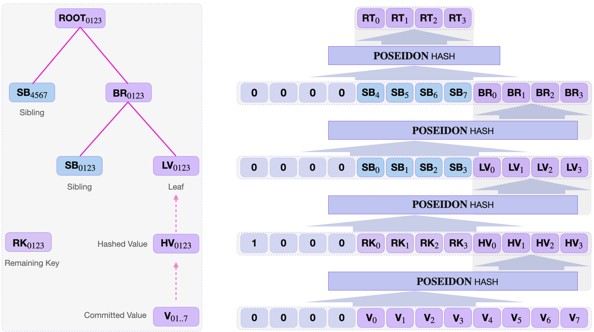

<b> Figure 2: Value UPDATE Example </b>

The above example captures in summary the following aspects about the Storage SM; 

- A brief preview of how the SMTs are constructed,
- A display of how a Merkle proof (climbing the tree) looks like in the Storage SM context, 
- The role played by the $\text{POSEIDON}$ Hash function, when carrying out the basic operations (CRUD).
- Also, the two $\text{POSEIDON}$ Hash functions, which are set apart by whether the capacity is $0000$ or $1000$. 

Nonetheless, given that we are dealing with a state machine here, there is a lot more detail needed on what is actually involved in the background. What is commonly a trivial computation when using a high-level programming language, requires a bit more machinery to be put in place in low-level programming.

A much more slower pace is henceforth adopted. Experienced developers can use the Table of Contents to jump to sections of interest.

## Storage Design - Preliminaries

Storage in the zkProver is designed in such a way that aggregators and verifiers can easily and efficiently interact with stored data. This is data that needed for providing zero-knowledge proofs, or verifying state.

Data is stored in the form of a special Sparse Merkle Tree (SMT), which is a tree that combines the concept of a Merkle Tree and that of a Patricia tree.

What follows is an explanation of how the zkProver storage, as a database, is designed. This design is based on how the Sparse Merkle Trees are constructed and how they store *keys* and *values*.

### Merkle Trees

A typical Merkle tree has ***leaves***, ***branches*** and a ***root***. A leaf is a node with no child-nodes, while a branch is a node with child-nodes. A root is therefore a node with no parent-node.

See Figure 3 below, for an example of how a hash function 
$\mathbf{H}$
 is used to create a Merkle tree to record eight (8) values; 
 $\text{V}_{\mathbf{a}}, \text{V}_{\mathbf{b}}, \text{V}_{\mathbf{c}}, \text{V}_{\mathbf{d}}, \text{V}_{\mathbf{e}}, \text{V}_{\mathbf{f}}, \text{V}_{\mathbf{g}}, \text{V}_{\mathbf{h}}$;

1. Each leaf is but the hash $\mathbf{H}(\text{V}_{\mathbf{i}})$ of a particular value $\text{V}_{\mathbf{i}}$, where   
    $\mathbf{ i} \in \{ \mathbf{a}, \mathbf{b}, \mathbf{c}, \mathbf{d}, \mathbf{e}, \mathbf{f}, \mathbf{g}, \mathbf{h} \}$.
2. The branches;  $\mathbf{B}_{\mathbf{ab}} = \mathbf{H} \big( \mathbf{H}(\text{V}_{\mathbf{a}})\| \mathbf{H}(\text{V}_{\mathbf{b}}) \big)$,  
    $\mathbf{B}_{\mathbf{cd}} = \mathbf{H} \big( \mathbf{H}(\text{V}_{\mathbf{c}})\| \mathbf{H}(\text{V}_{\mathbf{d}}) \big)$, 
    $\mathbf{B}_{\mathbf{ef}} = \mathbf{H} \big( \mathbf{H}(\text{V}_{\mathbf{e}})\| \mathbf{H}(\text{V}_{\mathbf{f}}) \big)$,  
    $\mathbf{B}_{\mathbf{gh}} = \mathbf{H} \big( \mathbf{H}(\text{V}_{\mathbf{g}})\| \mathbf{H}(\text{V}_{\mathbf{h}}) \big)$, $\mathbf{B}_{\mathbf{abcd}} = \mathbf{H} \big(\mathbf{B}_{\mathbf{ab}}\| \mathbf{B}_{\mathbf{cd}} \big)$  and  $\mathbf{B}_{\mathbf{efgh}} = \mathbf{H} \big( \mathbf{B}_{\mathbf{ef}}\| \mathbf{B}_{\mathbf{gh}} \big)$.
3. The root is  $\mathbf{root}_{\mathbf{a..h}} = \mathbf{H} \big(\mathbf{B}_{\mathbf{abcd}}\| \mathbf{B}_{\mathbf{efgh}} \big)$.

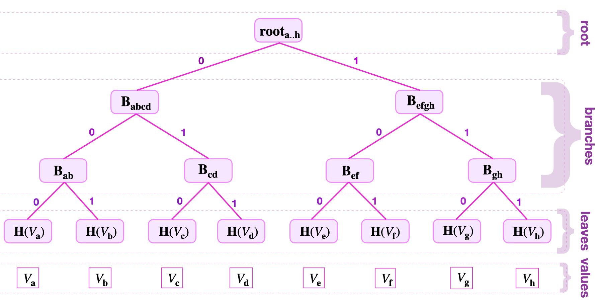

<b> Figure 3: A Merkle Tree Example </b>

Leaves that share a parent-node are called ***siblings***. The same terminology applies to branches. For example, $\mathbf{B}_{\mathbf{ab}}$ and $\mathbf{B}_{\mathbf{cd}}$ are siblings because they are branches of the same parent, $\mathbf{B}_{\mathbf{abcd}}$. Similarly, $\mathbf{B}_{\mathbf{efgh}}$ and $\mathbf{B}_{\mathbf{abcd}}$ are siblings. 

### Using Keys To Navigate A Merkle Tree

Keys are used to navigate from the root to the leaves (and backwards).

***Reading the key*** starting from ***the left to the right***, and when traversing the tree ***from the root downwards***,

-  a zero-key-bit "$0$" means "***follow the edge going to the left***", 

- a key-bit "$1$" means "***follow the edge going to the right***".

Consider the tree in Figure 1 above, as an example. Suppose one is given the key-value pair $( K_{\mathbf{d}} , V_{\mathbf{d}})$, where $K_{\mathbf{d}} = 10010110$.

The leaf $L_{\mathbf{d}}$, storing the value $V_{\mathbf{d}}$, is located uniquely by using the key, $K_{\mathbf{d} } = 10010110$, as follows;

1. Read the least-significant bit of $K_{\mathbf{d}}$, which is $0$, hence traverse the tree to the left, and reach $\mathbf{B_{abcd}}$.
2. Then read the second significant key-bit, which is "$1$" in this case. So take the edge going to the right, reaching $\mathbf{B_{cd}}$.
3. Again, read the next key-bit, which is "$1$", hence follow the edge going to the right, reaching the leaf $\mathbf{H}( V_{\mathbf{d}} )$.

Since $\mathbf{H}( V_{\mathbf{d}})$ is a leaf and not a branch, and the navigation was correctly done with respect to the given key $K_{\mathbf{d}}$, the $\mathbf{H}( V_{\mathbf{d}})$ must be the leaf storing the value $V_{\mathbf{d}}$.

One can similarly "climb" the tree, going in the reverse direction, by using the key-bits of the given key in the reverse order. i.e., Starting with the last key-bit used to reach the leaf and ending with the least-significant bit of the key.

The **tree-address** of the value $V_{\mathbf{x}}$, herein refers to the position of the leaf $L_{\mathbf{x}} := \mathbf{H}( V_{\mathbf{x}})$, denoted by the key-bits used to reach $L_{\mathbf{d}}$ but in the reverse order. 

In the above example (i.e., The tree in Figure 1), the tree-address of $V_{\mathbf{d}}$  is `011`.

### A Merkle Proof Example

Merkle Trees can be used as commitment schemes. 

Here's an example that follows the (key,value)-pair approach used in the zkProver. 

Consider the Merkle Tree shown in [Figure 3]() above. 

If the prover has committed to a value $\text{V}_{\mathbf{f}}$ by appending a new leaf $\mathbf{H}(\text{V}_{\mathbf{f}})$ to the Merkle Tree as in [Figure 3](), he must then avail the following information, to enable verification of his claim; 

1. The Merkle root $\mathbf{root}_{\mathbf{a..h}}$,
2. The value $\text{V}_{\mathbf{f}}$,
3. The siblings; $\mathbf{H}(\text{V}_{\mathbf{e}})$, $\mathbf{B}_{\mathbf{gh}}$ and $\mathbf{B}_{\mathbf{abcd}}$.

Instead of searching through all hash values stored in the tree, the verifier uses only a few hash values of relevant siblings. That is, three (3) in this case.

The verifier then checks the prover's claim by computing the Merkle root as follows;

​	(a)	He computes  $\mathbf{H}(\text{V}_{\mathbf{f}})$, which is the hash of the value $\text{V}_{\mathbf{f}}$.

​	(b)	Then uses the sibling  $\mathbf{H}(\text{V}_{\mathbf{e}})$  to compute  $\mathbf{H} \big( \mathbf{H}(\text{V}_{\mathbf{e}})\|\mathbf{H}(\text{V}_{\mathbf{f}}) \big) =: \tilde{ \mathbf{B}}_{\mathbf{ef}}$, which should be the same as the branch node $ \mathbf{B}_{\mathbf{ef}} $. 

(**Note.** The symbol, `tilde` " $\tilde{ }$ ", is used throughout the document to indicate that the computed value, $\tilde{\Box}$, still needs to be checked, or tested to be true.)

​	(c)	Next, he computes  $\mathbf{H} \big( \tilde{ \mathbf{B}}_{\mathbf{ef}}\|\mathbf{B}_{\mathbf{gh}} \big) =: \tilde{ \mathbf{B}}_{\mathbf{efgh}}$, corresponding to the branch node $\mathbf{B}_{\mathbf{efgh}}$.

​	(d)	Now, uses $\mathbf{H} \big( \mathbf{B}_{\mathbf{abcd}}\| \tilde{ \mathbf{B}}_{\mathbf{efgh}} \big) =: \tilde{ \mathbf{root}}_{\mathbf{a..h}}$.

The Merkle proof is concluded by checking whether $\tilde{ \mathbf{root}}_{\mathbf{a\dots h}}$ equals to the publicly known root $\mathbf{root}_{\mathbf{a..h}}$.

### Building Simplified Binary Sparse Merkle Trees

Consider key-value pair based binary Sparse Merkle Trees (SMTs). 

The focus here is on explaining how to build an SMT that represents a given set of key-value pairs. And, for simplicity sake, key-lengths of 8 bits are assumed.

A NULL or **empty** SMT has a zero root. That is, no key and no value recorded. Similarly, a zero node or NULL node refers to a node that carry no value.

#### A Binary SMT With One Key-Value Pair 

A binary SMT with a **single key-value pair** $(K_{\mathbf{a}}, \text{V}_{\mathbf{a}})$, is built as follows. 

Suppose that the key, $K_{\mathbf{a}} = 11010110$. In order to build a binary SMT with this single key-value $(K_{\mathbf{a}}, \text{V}_{\mathbf{a}})$,

(a)	One computes the hash $\mathbf{H}( \text{V}_{\mathbf{a}})$ of the value $\text{V}_{\mathbf{a}}$,

(b)	Sets the leaf $\mathbf{L}_{\mathbf{a}} := \mathbf{H}( \text{V}_{\mathbf{a}})$,

(c)	Sets the sibling leaf as a NULL leaf, simply represented as "$\mathbf{0}$", 

(d)	Computes the root as  $\mathbf{root}_{a0} = \mathbf{H}(\mathbf{L}_{\mathbf{a}} \| \mathbf{0} )$, with the leaf $\mathbf{L}_{\mathbf{a}}$ on the left because the $\text{lsb}(K_{\mathbf{a}}) = 0$. That is, between the two edges leading up to the root, the leaf $\mathbf{L}_{\mathbf{a}}$ is on the left edge, while the NULL leaf "$\mathbf{0}$" is on the right.

See, Figure 4 below, for the SMT representing the single key-value pair $(K_{\mathbf{a}}, \text{V}_{\mathbf{a}})$, where  $K_{\mathbf{a}} = 11010110$.

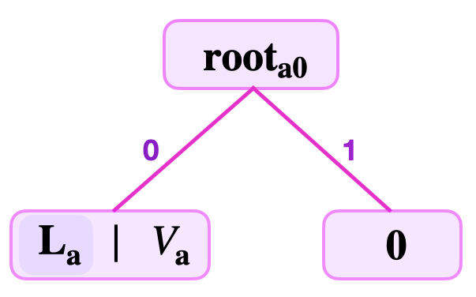

<b> Figure 4: A Single key-value pair SMT </b>

Note that the last nodes in binary SMT branches are generally either leaves or zero-nodes. 

In the case where the least-significant bit, **lsb of $K_{\mathbf{a}}$ is $1$**, the SMT with a single key-value pair $(K_{\mathbf{a}}, \text{V}_{\mathbf{a}})$ would be a mirror image of what is seen in Figure 3. And its root,  $\mathbf{root}_{0a} = \mathbf{H}( \mathbf{0}\| \mathbf{L}_{\mathbf{a}}  ) \neq \mathbf{root}_{a0}$ because $\mathbf{H}$ is a collision-resistant hash function.

This example also explains why we need a zero node. Since all trees used in our design are **binary** SMTs, a zero node is used as a default sibling for computing the parent node. This helps to differentiate between roots (also between parent nodes) because a root node actually identifies an SMT. Therefore, it is crucial to distinguish between  $\mathbf{root}_{a0} = \mathbf{H}(\mathbf{L}_{\mathbf{a}} \| \mathbf{0} )$ and $\mathbf{root}_{0a} = \mathbf{H}( \mathbf{0}\| \mathbf{L}_{\mathbf{a}})$ because they represent two distinct trees.

#### Binary SMTs With Two Key-Value Pairs

Consider now SMTs with **two key-value pairs**, $(K_{\mathbf{a}}, \text{V}_{\mathbf{a}})$ and $(K_{\mathbf{b}}, \text{V}_{\mathbf{b}})$. 

There are three distinct cases of how corresponding SMTs can be built, each determined by the keys, $K_{\mathbf{a}}$ and $K_{\mathbf{b}}$.

**Case 1**: The keys are such that the $\text{lsb}(K_{\mathbf{a}}) = 0$ and the $\text{lsb}(K_{\mathbf{b}}) = 1$.

Suppose that the keys are given as, $K_{\mathbf{a}} = 11010110$ and $K_{\mathbf{b}} = 11010101$. 

To build a binary SMT with this two key-values, $(K_{\mathbf{a}}, \text{V}_{\mathbf{a}})$ and $(K_{\mathbf{b}}, \text{V}_{\mathbf{b}})$,

(a)	One computes the hashes, $\mathbf{H}(\text{V}_{\mathbf{a}})$ and $\mathbf{H}( \text{V}_{\mathbf{b}})$ of the values, $\text{V}_{\mathbf{a}}$ and $\text{V}_{\mathbf{b}}$ , respectively,

(b)	Sets the leaves, $\mathbf{L}_{\mathbf{a}} := \mathbf{H}( \text{V}_{\mathbf{a}})$ and $\mathbf{L}_{\mathbf{b}} := \mathbf{H}( \text{V}_{\mathbf{b}})$,

(c)	Checks if the $\text{lsb}(K_{\mathbf{a}})$ differs from the $\text{lsb}(K_{\mathbf{b}})$,

(d)	Since the $\text{lsb}(K_{\mathbf{a}}) = 0$ and the $\text{lsb}(K_{\mathbf{b}}) = 1$, it means ***the two leaves can be siblings***,

(e)	One can then compute the root as, $\mathbf{root}_{\mathbf{ab}} = \mathbf{H}(\mathbf{L}_{\mathbf{a}} \| \mathbf{L}_{\mathbf{b}})$. 

​		Note that, the leaf $\mathbf{L}_{\mathbf{a}}$ is on the left because the $\text{lsb}(K_{\mathbf{a}}) = 0$, but $\mathbf{L}_{\mathbf{b}}$ is on the right because the $\text{lsb}(K_{\mathbf{b}}) = 1$. That is, between *the two edges leading up to the $\mathbf{root}_{\mathbf{ab}}$*, the leaf $\mathbf{L}_{\mathbf{a}}$ must be on the edge from the left, while $\mathbf{L}_{\mathbf{b}}$ is on the edge from the right.

See, Figure 5(a) below, for the SMT representing the two key-value pairs $(K_{\mathbf{a}}, \text{V}_{\mathbf{a}})$ and $(K_{\mathbf{b}}, \text{V}_{\mathbf{b}})$, where  $K_{\mathbf{a}} = 11010110$ and $K_{\mathbf{b}} = 11010101$.

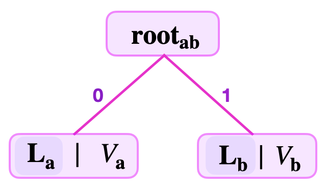

<b> Figure 5(a): Two key-value pairs SMT - Case 1 </b>

**Case 2**: Both keys end with the same key-bit. That is, the $\text{lsb}(K_{\mathbf{a}}) = \text{lsb}(K_{\mathbf{b}})$, but their second least-significant bits differ.

Suppose that the two keys are given as, $K_{\mathbf{a}} = 11010100$ and $K_{\mathbf{b}} = 11010110$. 

To build a binary SMT with this two key-values, $(K_{\mathbf{a}}, \text{V}_{\mathbf{a}})$ and $(K_{\mathbf{b}}, \text{V}_{\mathbf{b}})$;

(a)	One computes the hashes, $\mathbf{H}(\text{V}_{\mathbf{a}})$ and $\mathbf{H}( \text{V}_{\mathbf{b}})$ of the values, $\text{V}_{\mathbf{a}}$ and $\text{V}_{\mathbf{b}}$ , respectively.

(b)	Sets the leaves, $\mathbf{L}_{\mathbf{a}} := \mathbf{H}( \text{V}_{\mathbf{a}})$ and $\mathbf{L}_{\mathbf{b}} := \mathbf{H}( \text{V}_{\mathbf{b}})$.

(c)	Checks if the $\text{lsb}(K_{\mathbf{a}})$ differs from the $\text{lsb}(K_{\mathbf{b}})$. Since the $\text{lsb}(K_{\mathbf{a}}) = 0$ and the $\text{lsb}(K_{\mathbf{b}}) = 0$, it means ***the two leaves cannot be siblings*** at this position because it would otherwise mean they share the same tree-address `0`, which is not allowed.

(d)	One, therefore, continues to check if the second least-significant bits of  $K_{\mathbf{a}}$ and $K_{\mathbf{b}}$ differ. Since the $\text{second lsb}(K_{\mathbf{a}}) = 0$ and the $\text{second lsb}(K_{\mathbf{b}}) = 1$, it means ***the two leaves $\mathbf{L}_{\mathbf{a}}$ and $\mathbf{L}_{\mathbf{b}}$ can be siblings*** at their respective tree-addresses, `00` and `10`.

(e)	Next is to compute the hash $\mathbf{H}(\mathbf{L}_{\mathbf{a}} \| \mathbf{L}_{\mathbf{b}})$ and set it as the branch $\mathbf{B}_{\mathbf{ab}} := \mathbf{H}(\mathbf{L}_{\mathbf{a}} \| \mathbf{L}_{\mathbf{b}})$ at the tree-address `0`. Note that the leaf $\mathbf{L}_{\mathbf{a}}$ is on the left because the $\text{second  lsb}(K_{\mathbf{a}}) = 0$, while $\mathbf{L}_{\mathbf{b}}$ is on the right because the $\text{second  lsb}(K_{\mathbf{b}}) = 1$.

(f)	The branch $\mathbf{B}_{\mathbf{ab}} := \mathbf{H}(\mathbf{L}_{\mathbf{a}} \| \mathbf{L}_{\mathbf{b}})$ needs a sibling. Since all the values, $\text{V}_{\mathbf{a}}$ and $\text{V}_{\mathbf{b}}$, are already represented in the tree at $\mathbf{L}_{\mathbf{a}}$ and $\mathbf{L}_{\mathbf{b}}$, respectively, one therefore sets a NULL leaf "$\mathbf{0}$" as the sibling leaf to $\mathbf{B}_{\mathbf{ab}}$.

(g)	As a result, it is possible to compute the root as, $\mathbf{root}_{\mathbf{ab0}} = \mathbf{H}(\mathbf{B}_{\mathbf{ab}} \| \mathbf{0})$. Note that, the branch $\mathbf{B}_{\mathbf{ab}}$ is on the left because the $\text{lsb}(K_{\mathbf{a}}) = 0$, and $\mathbf{0}$ must therefore be on the right. That is, between *the two edges leading up to the $\mathbf{root}_{\mathbf{ab0}}$*, the branch $\mathbf{B}_{\mathbf{ab}}$ must be on the edge from the left, while $\mathbf{0}$ is on the edge from the right.

See, Figure 5(b) below, depicting the SMT representing the two key-value pairs $(K_{\mathbf{a}}, \text{V}_{\mathbf{a}})$ and $(K_{\mathbf{b}}, \text{V}_{\mathbf{b}})$, where  $K_{\mathbf{a}} = 11010100$ and $K_{\mathbf{b}} = 11010110$. 

<b> Figure 5(b): Two key-value pairs SMT - Case 2 </b>

**Case 3**: The first two least-significant bits of both keys are the same, but their third least-significant bits differ.

Suppose that the two keys are given as, $K_{\mathbf{a}} = 11011000$ and $K_{\mathbf{b}} = 10010100$. The process for building a binary SMT with this two key-values, $(K_{\mathbf{a}}, \text{V}_{\mathbf{a}})$ and $(K_{\mathbf{b}}, \text{V}_{\mathbf{b}})$ is the same as in Case 2;

(a)	One computes the hashes, $\mathbf{H}(\text{V}_{\mathbf{a}})$ and $\mathbf{H}( \text{V}_{\mathbf{b}})$ of the values, $\text{V}_{\mathbf{a}}$ and $\text{V}_{\mathbf{b}}$ , respectively.

(b)	Sets the leaves, $\mathbf{L}_{\mathbf{a}} := \mathbf{H}( \text{V}_{\mathbf{a}})$ and $\mathbf{L}_{\mathbf{b}} := \mathbf{H}( \text{V}_{\mathbf{b}})$.

(c)	Checks if the $\text{lsb}(K_{\mathbf{a}})$ differs from the $\text{lsb}(K_{\mathbf{b}})$. Since the $\text{lsb}(K_{\mathbf{a}}) = 0$ and the $\text{lsb}(K_{\mathbf{b}}) = 0$, it means ***the two leaves cannot be siblings*** at this position as it would otherwise mean they share the same tree-address `0`, which is not allowed.

(d)	Next verifier coninues to check if the second least-significant bits of $K_{\mathbf{a}}$ and $K_{\mathbf{b}}$ differ. Since the $\text{second lsb}(K_{\mathbf{a}}) = 0$  and the $\text{second lsb}(K_{\mathbf{b}}) = 0$, it means ***the two leaves cannot be siblings*** at this position, because it would otherwise mean they share the same tree-address `00`, which is not allowed.

(e)	Once again he checks if the third least-significant bits of $K_{\mathbf{a}}$ and $K_{\mathbf{b}}$ differ. Since the $\text{third lsb}(K_{\mathbf{a}}) = 0$ and the $\text{third  lsb}(K_{\mathbf{b}}) = 1$, it means ***the two leaves $\mathbf{L}_{\mathbf{a}}$ and $\mathbf{L}_{\mathbf{b}}$ can be siblings*** at their respective tree-addresses, `000` and `100`.

(f)	One then computes the hash $\mathbf{H}(\mathbf{L}_{\mathbf{a}} \| \mathbf{L}_{\mathbf{b}})$, and sets it as the branch $\mathbf{B}_{\mathbf{ab}} := \mathbf{H}(\mathbf{L}_{\mathbf{a}} \| \mathbf{L}_{\mathbf{b}})$ at the tree-address `00`. The leaf $\mathbf{L}_{\mathbf{a}}$ is on the left because the third $\text{lsb}(K_{\mathbf{a}}) = 0$, while $\mathbf{L}_{\mathbf{b}}$ is on the right because the third $\text{lsb}(K_{\mathbf{b}}) = 1$.

(g)	The branch $\mathbf{B}_{\mathbf{ab}} := \mathbf{H}(\mathbf{L}_{\mathbf{a}} \| \mathbf{L}_{\mathbf{b}})$ needs a sibling. Since all the values, $\text{V}_{\mathbf{a}}$ and $\text{V}_{\mathbf{b}}$ , are already represented in the tree at $\mathbf{L}_{\mathbf{a}}$ and $\mathbf{L}_{\mathbf{b}}$, respectively, one therefore sets a NULL leaf "$\mathbf{0}$" as the sibling leaf to $\mathbf{B}_{\mathbf{ab}}$.

(h)	One can now compute the hash $\mathbf{H}(\mathbf{B}_{\mathbf{ab}} \| \mathbf{0})$, and set it as the branch $\mathbf{B}_{\mathbf{ab0}} := \mathbf{H}(\mathbf{B}_{\mathbf{ab}} \| \mathbf{0})$ at the tree-address `0`. The hash is computed with the branch $\mathbf{B}_{\mathbf{ab}}$ on the left because the second lsb of both keys, $K_{\mathbf{a}}$ and $K_{\mathbf{b}}$, equals $0$. Therefore the NULL leaf "$\mathbf{0}$" must be on the right as an argument to the hash.

(i)	The branch $\mathbf{B}_{\mathbf{ab0}} := \mathbf{H}(\mathbf{B}_{\mathbf{ab}} \| \mathbf{0})$ also needs a sibling. For the same reason given above, one sets a NULL leaf "$\mathbf{0}$" as the sibling leaf to $\mathbf{B}_{\mathbf{ab0}}$. 

(j)	Now, one is able to compute the root as, $\mathbf{root}_{\mathbf{ab00}} = \mathbf{H}(\mathbf{B}_{\mathbf{ab0}} \| \mathbf{0})$. Note that the hash is computed with the branch $\mathbf{B}_{\mathbf{ab0}}$ on the left because the lsb of both keys, $K_{\mathbf{a}}$ and $K_{\mathbf{b}}$, equals $0$. That is, between *the two edges leading up to the $\mathbf{root}_{\mathbf{ab00}}$*, the branch $\mathbf{B}_{\mathbf{ab0}}$ must be on the edge from the left, while "$\mathbf{0}$" is on the edge from the right.

See, Figure 5(c) below, depicting the SMT representing the two key-value pairs $(K_{\mathbf{a}}, \text{V}_{\mathbf{a}})$ and $(K_{\mathbf{b}}, \text{V}_{\mathbf{b}})$, where  $K_{\mathbf{a}} = 11011000$ and $K_{\mathbf{b}} = 10010100$.

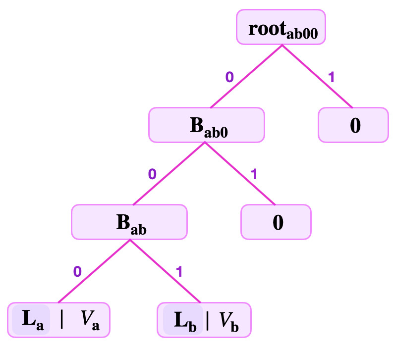

<b> Figure 5(c): Two key-value pairs SMT - Case 3 </b>

There are several other SMTs of two key-value pairs $(K_{\mathbf{x}}, \text{V}_{\mathbf{x}})$ and $(K_{\mathbf{z}}, \text{V}_{\mathbf{z}})$ that can be constructed depending on how long are the strings of the common least-significant bits between $K_{\mathbf{x}}$ and $K_{\mathbf{z}}$.

In general, when building an SMT, leaves of key-value pairs with the same least-significant key-bits share the same "navigational path" only until any of the corresponding key-bits differ. These common strings of key-bits dictate where the leaf storing the corresponding value is located in the tree.

### A Few More Concepts About Binary SMTs

In here are a few more concepts needed in understanding our specific design of the zkProver storage using binary SMTs. These concepts also help in elucidating how keys influence the shape of binary SMTs.

First is the level of a leaf. 

The **level of a leaf**, $\mathbf{L}_{\mathbf{x}}$, in a binary SMT is defined as the number of edges one traverses when navigating  from the root to the leaf. Denote the level of the leaf $\mathbf{L_x}$ by  $\text{lvl}(\mathbf{L_x})$.

#### Example 1. *Leaf Levels* 

Consider Figure 6 below, for an SMT storing seven (7) key-value pairs, built by following the principles explained in the foregoing subsection;

\begin{aligned}
(\mathbf{K}_{\mathbf{a}} , V_{\mathbf{a}}),\ \ (\mathbf{K}_{\mathbf{b}} , V_{\mathbf{b}}),\ \ 
(\mathbf{K}_{\mathbf{c}} , V_{\mathbf{c}}),\ \ (\mathbf{K}_{\mathbf{c}}, V_{\mathbf{c}}),\\ 
(\mathbf{K}_{\mathbf{d}}, V_{\mathbf{d}}),\ \ 
(\mathbf{K}_{\mathbf{e}}, V_{\mathbf{e}}),\ \ 
(\mathbf{K}_{\mathbf{f}}, V_{\mathbf{f}})\ \ {\text{and}}\ \ (\mathbf{K}_{\mathbf{g}} , V_{\mathbf{g}})
\end{aligned}

where the keys are,

\begin{aligned}
K_{\mathbf{a}} = 10101100, K_{\mathbf{b}} = 10010010, K_{\mathbf{c}} = 10001010, &K_{\mathbf{d}} = 11100110,\\ K_{\mathbf{e}} = 11110101, K_{\mathbf{f}} = 10001011, K_{\mathbf{g}} = 00011111.
\end{aligned}

The leaf levels are as follows; 
$\text{lvl}(\mathbf{L}_{\mathbf{a}}) = 2$ ,  
$\text{lvl}(\mathbf{L}_{\mathbf{b}}) = 4$ ,  
$\text{lvl}(\mathbf{L}_{\mathbf{c}}) = 4$ ,  
$\text{lvl}(\mathbf{L}_{\mathbf{d}}) = 3$ ,  
$\text{lvl}(\mathbf{L}_{\mathbf{e}}) = 2$ , 
$\text{lvl}(\mathbf{L}_{\mathbf{f}}) = 3$  and  
$\text{lvl}(\mathbf{L}_{\mathbf{g}}) = 3$.

 

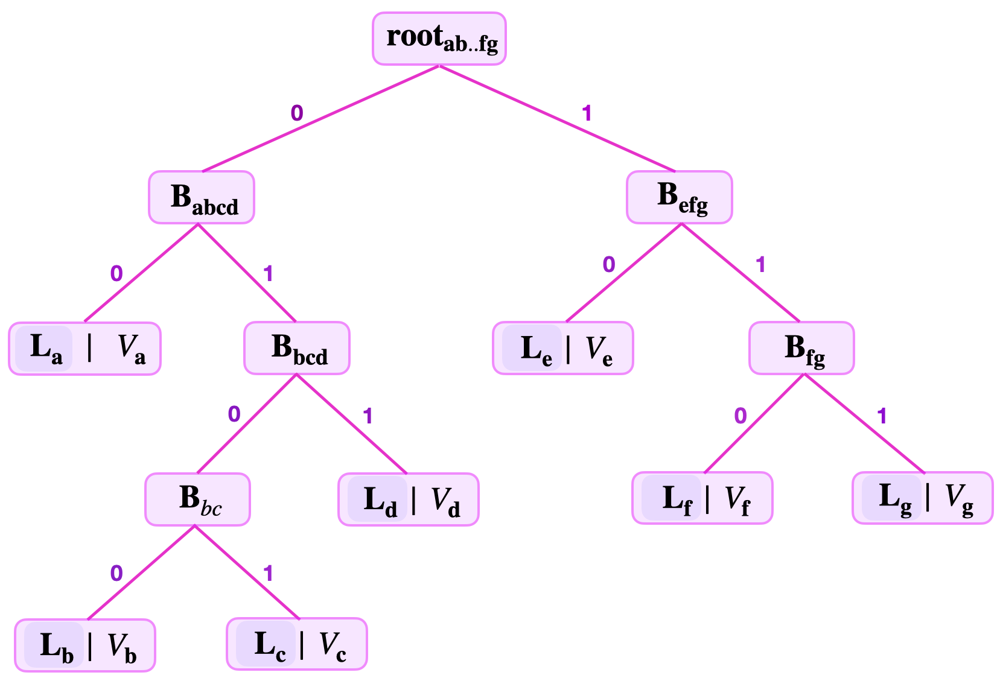

<b> Figure 6: An SMT of 7 key-value pairs </b>

As illustrated, in the above subsections, keys basically determine the shape of the SMT. They dictate where respective leaves must be placed when building the SMT. 

The main determining factor of the SMT shape is in fact the common key-bits among the keys. For instance, the reason why the leaves $\mathbf{L}_{\mathbf{b}}$ and $\mathbf{L}_{\mathbf{c}}$ have the largest leaf level $4$ is because the two leaves have the longest string of common key-bits "$010$" in the SMT of Figure 6 above.

This explains why different leaves in SMTs can have different levels.

The **height of a Merkle Tree** refers to the largest number of edges traversed when navigating from the root to any leaf. Since all leaves are of the same level in Merkle Trees, the concept of a **height** coincide with that of the **level of a leaf** for Merkle Trees.

But this is not the case for SMTs. Since leaf levels differ from one leaf to another in SMTs, the height of an SMT is not the same as the leaf level.

Rather, the **height of an SMT** is defined as the largest leaf level among the various leaf levels of leaves on the SMT. For instance, *the height of the SMT* depicted in Figure 6 above, is $4$. 

Now, since all keys have the same fixed key-length, they not only influence SMT leaf levels and shapes, but also restrict SMT heights to the fixed key-length. The maximum height of an SMT is the maximum key-length imposed on all keys.

#### The Remaining Key

In a general Sparse Merkle Tree (SMT) values are stored at their respective leaf-nodes. 

But a leaf node $\mathbf{L}_{\mathbf{x}}$ not only stores a value, $V_{\mathbf{x}}$ , but also the key-bits that are left unused in the navigation from the root to $\mathbf{L}_{\mathbf{x}}$. These unused key-bits are called **the remaining key**, and are denoted by $\text{RK}_{\mathbf{x}}$ for the leaf node $\mathbf{L}_{\mathbf{x}}$.

#### Example 2. *Remaining Keys*

Consider again the SMT of the 7 key-value pairs depicted in Figure 6 above. 

The remaining keys of each of the 7 leaves in the SMT are as follows; 

$\text{RK}_{\mathbf{a}} = 110101$,  $\text{RK}_{\mathbf{b}} = 1001$,  $\text{RK}_{\mathbf{c}} = 0001$,  $\text{RK}_{\mathbf{d}} = 00111$,  $\text{RK}_{\mathbf{e}} = 101111$,  $\text{RK}_{\mathbf{f}} = 10001$  and  $\text{RK}_{\mathbf{g}} = 11000$.

### The Fake-Leaf Attack

Note that the above simplified design of binary SMTs, based on key-value pairs, presents some problems.

The characteristic of binary SMTs having leaves at different levels can be problematic to verifiers, especially when carrying out a simple Merkle proof. 

#### Scenario A: Fake SMT Leaf

What if the verifier is presented with a fake leaf?

Consider Figure 7 below, showing a binary SMT with a branch $\mathbf{{B}_{ab}}$ and its children $\mathbf{L_{a}}$ and $\mathbf{L_{b}}$ hidden from the verifier's sight.

That is, suppose the verifier is provided with the following information;

- The key-value $(K_{\mathbf{fk}}, V_\mathbf{{fk}})$, where $K_{\mathbf{fk}} = 11010100$ and $V_{\mathbf{fk}} = \mathbf{L_{a}} \| \mathbf{L_{b}}$.
- The root  $ \mathbf{{root}_{ab..f}}$ , the number of levels to root, and the siblings $\mathbf{{S}_{\mathbf{cd}}}$ and $\mathbf{{S}_{\mathbf{ef}}}$.

That is, the Attacker claims that some $V_{\mathbf{fk}}$ is stored at $\mathbf{L_{fk}} := \mathbf{{B}_{ab}}$.

Verifier is unaware that $V_{\mathbf{fk}}$ is in fact the concatenated value of the hidden real leaves, $\mathbf{L_{a}}$ and $\mathbf{L_{b}}$, that are children of the *supposed* leaf $\mathbf{L_{fk}}$. i.e., Verifier does not know that leaf $\mathbf{L_{fk}}$ is in fact a branch.

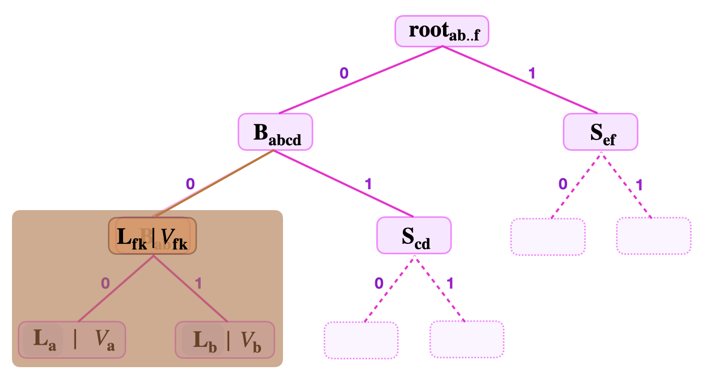

<b> Figure 7: MPT - Fake Leaf Attack </b>

So then, the verifier being unaware that $\mathbf{L_{fk}}$ is not a properly constructed leaf, starts verification as follows; 

1. He uses the key $K_{\mathbf{fk}}$ to navigate the tree until locating the supposed leaf $\mathbf{L_{fk}}$.
2. He computes $\mathbf{H}(V_{\mathbf{fk}})$ and sets it as 
    $\tilde{\mathbf{L}}_{\mathbf{fk}} := \mathbf{H}(V_{\mathbf{fk}})$. 
3. Then takes the sibling $\mathbf{{S}_{\mathbf{cd}}}$ and calculates  
    $\tilde{ \mathbf{B}}_{\mathbf{fkcd}} = \mathbf{H} \big( \tilde{\mathbf{L}}_{\mathbf{fk}} \| \mathbf{S}_{\mathbf{cd}}  \big)$. 
4. And then, uses $\tilde{ \mathbf{B}}_{\mathbf{fkcd}}$ to compute the root,  $\tilde{ \mathbf{root}}_{\mathbf{ab..f}} = \mathbf{H} \big( \tilde{ \mathbf{B}}_{\mathbf{fkcd}}\| \mathbf{S}_{\mathbf{ef}} \big)$.

The question is: "Does the fake leaf $\mathbf{L_{fk}}$ pass the verifier's Merkle proof or not?" Or, equivalently: "Is $\tilde{ \mathbf{root}}_{\mathbf{ab..f}}$ equal to $\mathbf{root}_{\mathbf{ab..f}}$?"

Since the actual branch $\mathbf{{B}_{ab}}$ is by construction the hash, 
$\mathbf{H}(\mathbf{L_{a}} \| \mathbf{L_{b}})$, then 
$\mathbf{{B}_{ab}} = \tilde{\mathbf{L}}_{\mathbf{fk}}$. 
The parent branch ${\mathbf{B}}_{\mathbf{abcd}}$ also, being constructed as the hash, 
$\mathbf{H} \big( \mathbf{B}_{\mathbf{ab}}\| { \mathbf{S}}_{\mathbf{cd}} \big)$, should be equal to $\mathbf{H} \big( \tilde{\mathbf{L}}_{\mathbf{fk}} \| \mathbf{S}_{\mathbf{cd}}  \big)  = \tilde{ \mathbf{B}}_{\mathbf{fkcd}}$. As a result, $\mathbf{root}_{\mathbf{ab..f}} = \mathbf{H} \big(  {\mathbf{B}}_{\mathbf{abcd}} \| \mathbf{S}_{\mathbf{ef}} \big) = \mathbf{H} \big( \tilde{ \mathbf{B}}_{\mathbf{fkcd}}\| \mathbf{S}_{\mathbf{ef}} \big) = \tilde{ \mathbf{root}}_{\mathbf{ab..f}}$. 

Therefore, the fake leaf $\mathbf{L_{fk}}$ passes the Merkle proof. 

#### Solution To The Fake-Leaf Attack

In order to circumvent the Fake-Leaf Attack we modify how the binary SMTs are built.

Here's ***the trick***: When building binary SMTs, differentiate between how leaves are hashed and how branches are hashed.

That is, use two different hash functions; one hash function to hash leaves, denote it by $\mathbf{H}_{\mathbf{leaf}}$, and the other function for hashing non-leaf nodes, denote it by $\mathbf{H}_{\mathbf{noleaf}}$.

**How does this prevent the Fake-Leaf Attack?**

Reconsider now, the Scenario A, given above. 

Recall that the Attacker provides the following;

- The key-value $(K_{\mathbf{fk}}, V_\mathbf{{fk}})$, where $K_{\mathbf{fk}} = 11010100$ and $V_{\mathbf{fk}} = \mathbf{L_{a}} \| \mathbf{L_{b}}$.
- The root  $ \mathbf{{root}_{ab..f}}$ , the number of levels to root, and the siblings  $\mathbf{{S}_{\mathbf{cd}}}$  and  $\mathbf{{S}_{\mathbf{ef}}}$.

The verifier suspecting no foul, uses $K_{\mathbf{fk}} = 11010100$ to navigate the tree until he finds $V_{\mathbf{fk}}$ stored at $\mathbf{L_{fk}} := \mathbf{{B}_{ab}}$. 

He subsequently starts the Merkle proof by hashing the value $\tilde{V}_{\mathbf{fk}}$ stored at the located leaf. Since, this computation amounts to forming a leaf, he uses the leaf-hash function, $\mathbf{H}_{\mathbf{leaf}}$. 

- He then sets $\tilde{\mathbf{L}}_{\mathbf{fk}}  :=  \mathbf{H}_{\mathbf{leaf}} \big( V_{\mathbf{fk}} \big) = \mathbf{H}_{\mathbf{leaf}} \big( \mathbf{L_{a}} \| \mathbf{L_{b}} \big)$.
- And further computes  $\tilde{ \mathbf{B}}_{\mathbf{fkcd}} = \mathbf{H}_{\mathbf{noleaf}} \big( \tilde{\mathbf{L}}_{\mathbf{fk}} \| \mathbf{S}_{\mathbf{cd}}  \big)$. 
- Again, calculates the root,  $\tilde{ \mathbf{root}}_{\mathbf{ab..f}} = \mathbf{H}_{\mathbf{noleaf}} \big( \tilde{ \mathbf{B}}_{\mathbf{fkcd}}\| \mathbf{S}_{\mathbf{ef}} \big)$.

But the actual branch $\mathbf{{B}_{ab}}$ was constructed with the no-leaf-hash function, 
$\mathbf{H}_{\mathbf{noleaf}}$. That is, 

\begin{aligned}
\mathbf{{B}_{ab}} = \mathbf{H}_{\mathbf{noleaf}} (\mathbf{L_{a}} \| \mathbf{L_{b}}) \neq \mathbf{H}_{\mathbf{leaf}} \big(\mathbf{L_{a}} \| \mathbf{L_{b}} \big) = \tilde{\mathbf{L}}_{\mathbf{fk}}.
\end{aligned}

The parent branch ${\mathbf{B}}_{\mathbf{abcd}}$ also, was constructed as, ${\mathbf{B}}_{\mathbf{abcd}} = \mathbf{H}_{\mathbf{noleaf}} \big( \mathbf{B}_{\mathbf{ab}}\| { \mathbf{S}}_{\mathbf{cd}} \big)$. 
Since the hash functions used are collision-resistant, 
${\mathbf{B}}_{\mathbf{abcd}}$ cannot be equal to 
$\mathbf{H}_{\mathbf{noleaf}} \big( \tilde{\mathbf{L}}_{\mathbf{fk}} \| \mathbf{S}_{\mathbf{cd}}  \big)  = \tilde{ \mathbf{B}}_{\mathbf{fkcd}}$. 
Consequently, $\mathbf{root}_{\mathbf{ab..f}}  \neq \tilde{ \mathbf{root}}_{\mathbf{ab..f}}$.
Therefore, the Merkle Proof fails. 

### Non-Binding Key-Value Pairs

Whenever the verifier needs to check inclusion of the given key-value pair $(K_{\mathbf{x}}, \text{V}_{\mathbf{x}})$ in a binary SMT identified by the $\mathbf{{root}_{a..x}}$, he first navigates the SMT in order to locate the leaf $\mathbf{{L}_{x}}$ storing $\text{V}_{\mathbf{x}}$, and thereafter carries out two computations. 

Both computations involve climbing the tree from the located leaf $\mathbf{{L}_{x}}$ back to the root, $\mathbf{{root}_{a..x}}$. And the two computations are;

1. Checking **correctness of the key** $K_{\mathbf{x}}$. 

   That is, verifier takes the Remaining Key, $\text{RK}_{\mathbf{x}}$, and reconstructs the key $K_{\mathbf{x}}$ by concatenating the key bits used to navigate to $\mathbf{{L}_{x}}$ from $\mathbf{{root}_{a..x}}$, in the reverse order.

   Suppose the *number of levels to root* is 3, and the least-significant bits used for navigation are $ \text{kb}_\mathbf{2}$, $ \text{kb}_\mathbf{1}$ and $\text{kb}_\mathbf{0}$. 

   In order to check key-correctness, verifier the remaining key $\text{RK}$ and, 

   (a)	Concatenates $ \text{kb}_\mathbf{2}$ and gets $\text{ } \text{RK} \|  \text{kb}_\mathbf{2}$,
   (b)	Concatenates $ \text{kb}_\mathbf{1}$ then gets $\text{ } \text{RK} \|  \text{kb}_\mathbf{2} \|   \text{kb}_\mathbf{1}$,
   (c)	Concatenates $ \text{kb}_\mathbf{0}$ and gets $\text{ }  \text{RK} \|  \text{kb}_\mathbf{2} \|   \text{kb}_\mathbf{1} \|  \text{kb}_\mathbf{0}$.

   He then sets $\tilde{K}_{\mathbf{x}} := \text{RK} \|  \text{kb}_\mathbf{2} \|   \text{kb}_\mathbf{1} \|  \text{kb}_\mathbf{0}$ , and checks if $\tilde{K}_{\mathbf{x}}$ equals $K_{\mathbf{x}}$. 

2. **The Merkle proof**: That is, checking whether the value stored at the located leaf $\mathbf{{L}_{x}}$ was indeed included in computing the root, $\mathbf{{root}_{a..x}}$. 

   This computation was illustrated several times in the above discussions. Note that the *key-correctness* and the Merkle proof are simultaneously carried out. 

#### Example 3. (Indistinguishable Leaves)

Suppose a binary SMT contains a key-value pair $(K_{\mathbf{d}}, V_\mathbf{{d}})$ at the leaf $\mathbf{L_{d}}$, where $K_{\mathbf{d}} = 11100110$. 
That is, $\mathbf{L_{d}} := \mathbf{H_{leaf}}(V_\mathbf{{d}})$.

Note that, when building binary SMTs, it is permissible to have another key-value pair $(K_{\mathbf{x}}, V_\mathbf{{x}})$ in the same tree with $V_\mathbf{{x}} = V_\mathbf{{d}}$.

An Attacker can pick the key-value pair $(K_{\mathbf{x}}, V_\mathbf{{x}})$ such that $V_\mathbf{{x}} = V_\mathbf{{d}}$ and $K_{\mathbf{x}} = 10100110$. And, with the above design, it means  $\mathbf{L_{x}} = \mathbf{H_{leaf}}(V_\mathbf{{x}}) = \mathbf{H_{leaf}}(V_\mathbf{{d}}) =  \mathbf{L_{d}}$.

Consider Figure 8 below. And suppose the Attacker provides the following data;

- The key-value $(K_{\mathbf{x}}, V_\mathbf{{x}})$, where 
  $K_{\mathbf{x}} = 10100110$ and $V_{\mathbf{x}} = V_\mathbf{d}$.
- The root, $ \mathbf{{root}_{a..x}}$, the number of *levels to root* = 3, and the siblings 
$\mathbf{{B}_{\mathbf{bc}}}$, $\mathbf{L_{a}}$ and  $\mathbf{{S}_{\mathbf{efg}}}$. 

The verifier uses the least-significant key bits; $\text{kb}_\mathbf{0} = 0$, 
$\text{kb}_\mathbf{1} = 0$ and $ \text{kb}_\mathbf{2} = 1$; 
to navigate the tree and locate the leaf $\mathbf{L_{x}}$ which is positioned at $\mathbf{L_{d}}$, see Figure 7 below.

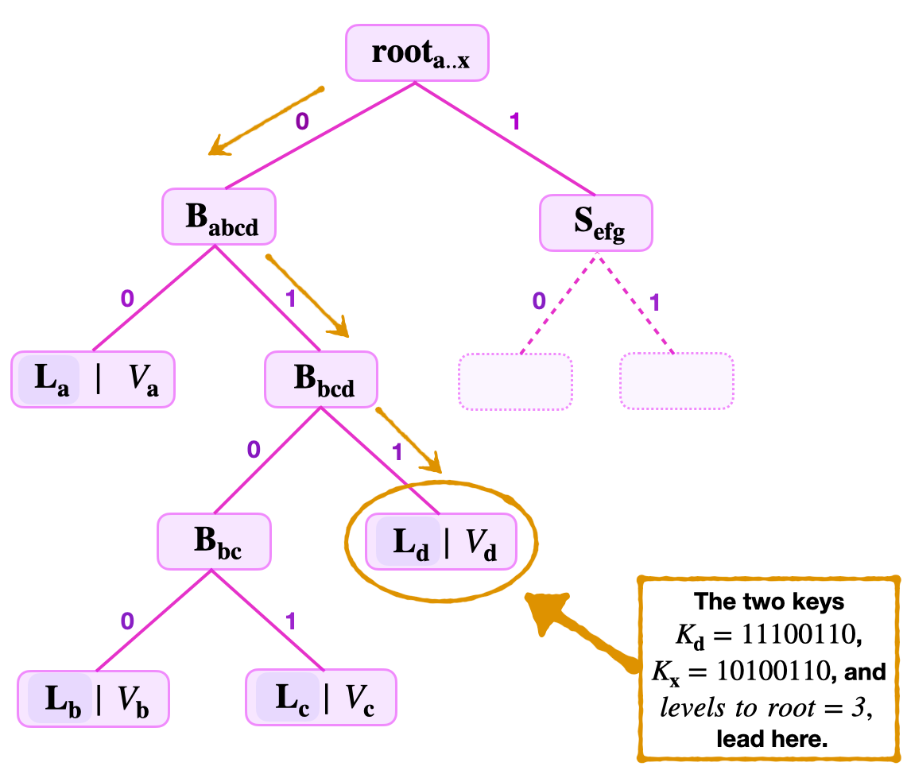

<b> Figure 8: Non-binding Key-Value Pairs</b>

In order to ensure that $\mathbf{L_{x}}$ actually stores the value $V_\mathbf{{x}}$; The verifier first checks key-correctness. He takes the remaining key $\text{RK} = 10100$ and, 

​	(a)	Concatenates $ \text{kb}_\mathbf{2} = 1 $, and gets $\text{ } \text{RK} \| \text{kb}_\mathbf{2} = 10100 \|1$, 
​	(b)	Concatenates $ \text{kb}_\mathbf{1} = 0$  to get $\text{ } \text{RK} \| \text{kb}_\mathbf{2} \|  \text{kb}_\mathbf{1} = 10100 \|1\|0$,
​	(c)	Concatenates $\text{kb}_\mathbf{0} = 0$, yielding $\text{ }  \text{RK} \| \text{kb}_\mathbf{2} \|  \text{kb}_\mathbf{1} \| \text{kb}_\mathbf{0} = 10100 \|1\|0\|0$. 

He sets $\tilde{K}_{\mathbf{x}} := 10100 \|1\|0\|0 = 10100100$. Since $\tilde{K}_{\mathbf{x}}$ equals $K_{\mathbf{x}}$, the verifier concludes that the supplied key is correct. 

As the verifier 'climbs' the tree to test key-correctness, he concurrently checks if the value $V_\mathbf{{x}}$ is included in the SMT identified by the given root, $ \mathbf{{root}_{a..x}}$. That is, he executes the following computations;

​	(a)	He computes the hash of $V_\mathbf{{x}}$ and sets it as, $\tilde{\mathbf{L}}_\mathbf{x}:= \mathbf{H_{leaf}}(V_\mathbf{{x}})$.
​	(b)	Then he uses $\mathbf{{B}_{\mathbf{bc}}}$ to compute, $\tilde{\mathbf{B}}_{\mathbf{bcd}} = \mathbf{H_{noleaf}}(\mathbf{{B}_{\mathbf{bc}}} \|\tilde{\mathbf{L}}_\mathbf{x})$.
​	(c)	He also uses $\mathbf{L_{a}}$ to compute, $\tilde{\mathbf{B}}_{\mathbf{abcd}} = \mathbf{H_{noleaf}}(\mathbf{L_{a}} \| \tilde{\mathbf{B}}_{\mathbf{bcd}} ) $.
​	(d)	He further calculates, $\tilde{\mathbf{root}}_{\mathbf{abcd}} = \mathbf{H_{noleaf}}(\tilde{\mathbf{B}}_{\mathbf{abcd}} \| \mathbf{{S}_{\mathbf{efg}}} ) $. 

Next, the verifier checks if $\tilde{\mathbf{root}}_{\mathbf{abcd}}$ equals $\mathbf{root}_{\mathbf{abcd}}$.

Since $V_\mathbf{{x}} = V_\mathbf{{d}}$, it follows that all the corresponding intermediate values to the root are equal;

- $\mathbf{L_{d}} = \mathbf{H_{leaf}}(V_\mathbf{{d}}) = \mathbf{H_{leaf}}(V_\mathbf{{x}}) = \tilde{\mathbf{L}}_\mathbf{x}$, 
- $\mathbf{B}_{\mathbf{bcd}} = \mathbf{H_{noleaf}}(\mathbf{{B}_{\mathbf{bc}}} \| \mathbf{L}_\mathbf{d}) = \mathbf{H_{noleaf}}(\mathbf{{B}_{\mathbf{bc}}} \|\tilde{\mathbf{L}}_\mathbf{x}) = \tilde{\mathbf{B}}_{\mathbf{bcd}}$, 
- $ \mathbf{B}_{\mathbf{abcd}} = \mathbf{H_{noleaf}}(\mathbf{L_{a}} \| \mathbf{B}_{\mathbf{bcd}} ) = \mathbf{H_{noleaf}}(\mathbf{L_{a}} \| \tilde{\mathbf{B}}_{\mathbf{bcd}} ) = \tilde{\mathbf{B}}_{\mathbf{abcd}}$, 
- $\mathbf{root}_{\mathbf{abcd}} = \mathbf{H_{noleaf}}(\mathbf{B}_{\mathbf{abcd}} \| \mathbf{{S}_{\mathbf{efg}}} )  = \mathbf{H_{noleaf}}(\tilde{\mathbf{B}}_{\mathbf{abcd}} \| \mathbf{{S}_{\mathbf{efg}}} ) = \tilde{\mathbf{root}}_{\mathbf{abcd}} $.  

The verifier therefore concludes that the key-value pair $(K_{\mathbf{x}}, V_\mathbf{{x}})$ is in the SMT, when it is not.

**Why is this attack successful?**

Note that equality of values, $V_\mathbf{{x}} = V_\mathbf{{d}}$, associated with two distinct keys, has nothing to do with the efficacy of this attack. In fact, for all practical purposes, it should be permissible for distinct leaves to store any value, irrespective of whether other leaves store an equivalent value or not.

The downfall of our binary SMTs design, thus far, is that it does not give the verifier any equation that relates or ties the keys to their associated values.

In other words, the attack succeeds simply because the key-value pairs (as 'committed' values) are not binding.

#### Solution To The Non-Binding Key-Value Problem

The solution to this problem is straightforward, and it is to build the binary SMTs in such a way that the key-value pairs are binding. 

This means, create a relationship between the keys and their associated values, so that the verifier can simply check if this relationship holds true.

In order to ensure that *checking such a relationship* blends with the usual proof machinery, one has two options. 

The naïve solution, which involves the keys, is one option.

##### The Naïve Solution

The naïve solution is to simpy include keys in the argument of the hash function, when forming leaves.

That is, when building a binary SMT, one includes a key-value pair $(K_{\mathbf{x}}, V_\mathbf{{x}})$ by setting the leaf $\mathbf{L_{x}}$ to be the hash of both the value and the key;
$$
\mathbf{L_{x}} = \mathbf{H_{leaf}}(K_{\mathbf{x}} \| V_\mathbf{{x}} )
$$

**Does this change remedy the non-binding problem?**

Suppose $(K_{\mathbf{x}}, V_\mathbf{{x}})$ and $(K_{\mathbf{z}}, V_\mathbf{{z}})$ are two key-value pairs such that $V_\mathbf{{x}} = V_\mathbf{{z}}$ , while $K_\mathbf{{x}}$ and $K_\mathbf{{z}}$ differ only in one of the most-significant bits.

Since the hash functions used are collision-resistant, it follows that 
$$
\mathbf{L_{x}} = \mathbf{H_{leaf}}(K_{\mathbf{x}} \| V_\mathbf{{x}}) \neq \mathbf{H_{leaf}}(K_{\mathbf{z}} \| V_\mathbf{{z}}) = \mathbf{L_{z}}
$$
Consequently, although the key-value pairs $(K_{\mathbf{x}}, V_\mathbf{{x}})$ and $(K_{\mathbf{z}}, V_\mathbf{{z}})$ might falsely pass the key-correctness check, they will not pass the Merkle proof test. And this is because, collision-resistance also guarantees that the following series of inequalities hold true;
$$
\mathbf{L_{x}} = \mathbf{H_{leaf}}(K_{\mathbf{x}} \| V_\mathbf{{x}}) \neq \mathbf{H_{leaf}}(K_{\mathbf{z}} \| V_\mathbf{{z}}) = \mathbf{L_{z}} \\ 
\\ 
\mathbf{B_{bx}} = \mathbf{H_{noleaf}}(\mathbf{S}_\mathbf{{b}} \| \mathbf{L}_{\mathbf{x}}) \neq \mathbf{H_{noleaf}}(\mathbf{S}'_\mathbf{{b}} \| \mathbf{L}_{\mathbf{z}}) = \mathbf{B_{bz}} \\ 
\\ 
\mathbf{B_{abx}} = \mathbf{H_{noleaf}}(\mathbf{S}_\mathbf{{a}} \| \mathbf{B_{bx}} ) \neq \mathbf{H_{noleaf}}(\mathbf{S}'_\mathbf{{a}} \| \mathbf{B_{bz}}) = \mathbf{B_{abz}}
$$

where; $\mathbf{S}_\mathbf{{b}}$ is a sibling to $\mathbf{L}_{\mathbf{x}}$, and $\mathbf{S}_\mathbf{{a}}$ is a sibling to $\mathbf{B_{bx}}$, making $\mathbf{B_{bx}}$ and $\mathbf{B_{abx}}$ branches traversed while climbing the tree from $\mathbf{L_{x}}$ to root; Similarly,  $\mathbf{S}'_\mathbf{{b}}$ is a sibling to $\mathbf{L}_{\mathbf{z}}$, while $\mathbf{S}'_\mathbf{{a}}$ is a sibling to $\mathbf{B_{bx}}$, also making $\mathbf{B_{bz}}$ and $\mathbf{B_{abz}}$ branches traversed while climbing the tree from $\mathbf{L_{z}}$ to root.

The only chance for the Merkle proof to pass is if the key-value pairs $(K_{\mathbf{x}}, V_\mathbf{{x}})$ and $(K_{\mathbf{z}}, V_\mathbf{{z}})$ are distinct and are individually on the same SMT. 

The inclusion of keys, in the argument of the hash functions, therefore ensures that leaves $\mathbf{L_{x}}$ and $\mathbf{L_{z}}$ are distinguishable. And most importantly, that key-value pairs in our SMTs are now binding.

##### A Better Solution

The other solution, which is much more apt than the Naïve option, utilises the remaining keys when forming leaves.

Since *levels to root* is related to the *Remaining Key* ($\text{RK}$) notion, a much more apt solution is to rather include the remaining key, $\text{RK}_\mathbf{x}$, as the argument to the hash function, instead of the whole key $K_{\mathbf{x}}$.

That is, for a key-value pair $(K_{\mathbf{x}}, V_\mathbf{{x}})$, one sets the leaf $\mathbf{L_{x}}$ to be the hash of both the value and the remaining key;
$$
\mathbf{L_{x}} = \mathbf{H_{leaf}}( \text{RK}_\mathbf{x}  \| \text{V}_\mathbf{{x}}).
$$

With this strategy, the verifier needs the remaining key $\text{RK}_\mathbf{{x}}$ , instead of the whole key, in order to carry out a Merkle proof. So he adjusts the Merkle proof by; 

- Firstly, picking the correct hash function $\mathbf{H_{leaf}}$ for leaves, 
- Secondly, concatenating the value $V_{\mathbf{x}}$ stored at the leaf $L_{\mathbf{x}}$ and the remaining key $\text{RK}_\mathbf{{x}}$, instead of the whole key $K_{\mathbf{x}}$,
- Thirdly, hashing the concatenation $\mathbf{H_{leaf}}( \text{RK}_\mathbf{x}  \| \text{V}_\mathbf{{x}}) =: \mathbf{L_{x}}$.

This approach not only ensures that key-value pairs in our SMTs are now binding, but also implicitly 'encodes' the levels to root in the leaf.

The strategy of using the $\text{RK}_\mathbf{x}$ instead of the key $K_{\mathbf{x}}$, coupled with hashing leaves and branches differently, yields sound verification.

#### Introducing Zero-Knowledge

It is often necessary to make sure that a proof-integrity system has the zero-knowledge property. In order to introduce zero-knowledge, instead of storing values as plaintexts in the leaves, one stores hashes of these values.

A leaf therefore is henceforth constructed in two steps;

- Firstly, for a key-value pair $(K_{\mathbf{x}}, V_\mathbf{{x}})$, compute the hash the value $V_\mathbf{{x}}$, 
  $$
  \text{Hashed Value} = \text{HV}_\mathbf{{x}} = \mathbf{H_{noleaf}}(V_\mathbf{{x}})
  $$

- Secondly, form the leaf containing $V_\mathbf{{x}}$, as follows,
  $$
  \mathbf{L_{x}} = \mathbf{H_{leaf}}(  \text{RK}_\mathbf{x}  \| \text{HV}_\mathbf{{x}})
  $$

Since it is infeasible to compute the preimage of the hash functions, $\mathbf{H_{leaf}}$ and $\mathbf{H_{noleaf}}$, computing the hash of the value $V_\mathbf{{x}}$ amounts to 'encrypting'.

The prover therefore achieves zero-knowledge by providing the pair, $(K_{\mathbf{x}}, \text{HV}_\mathbf{{x}})$, as the key-value pair instead of the explicit one, $(K_{\mathbf{x}}, V_\mathbf{{x}})$.

The verifier, on the other hand, has to adjust the Merkle proof by starting with; 

- Firstly, picking the correct hash function $\mathbf{H_{leaf}}$ for leaf nodes,
- Secondly, concatenating the hashed-value $\text{HV}_\mathbf{{x}}$ and the remaining key $\text{RK}_\mathbf{{x}}$,
- Thirdly, hashing the concatenation in order to form the leaf, $\mathbf{L_{x}} := \mathbf{H_{leaf}}( \text{RK}_\mathbf{x}  \| \text{HV}_\mathbf{{x}})$.

#### Example 4. (Zero-Knowledge Merkle Proof)

The following example illustrates a Merkle proof when the above strategy is applied.

Consider an SMT where the keys are 8-bit long, and the prover commits to the key-value $( K_{\mathbf{c}} , \text{HV}_{\mathbf{c}} )$ with $K_{\mathbf{c}} = 10010100$. See Figure 9 below. 

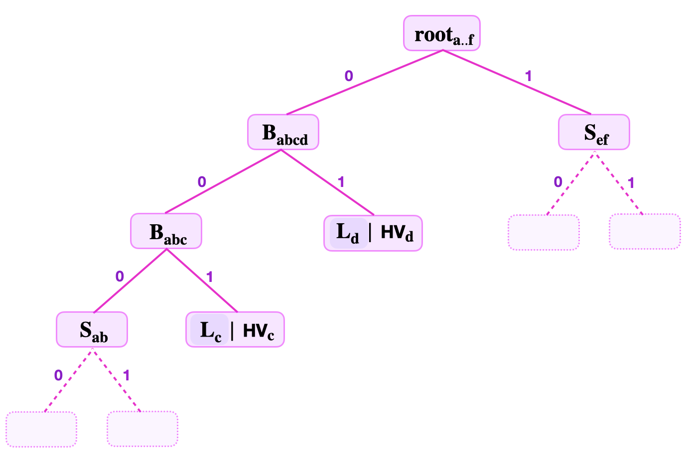

<b> Figure 9 : ZK Merkle Proof Example </b>

Since the levels to root is 3, the prover provides; the least-significant key-bits, $\text{kb}_0 = 0$, $\text{kb}_1 = 0$, $\text{kb}_2 = 1$, the stored hashed-value $\text{HV}_{\mathbf{c}}$, the root  $\mathbf{{root}_{a..f}}$, the Remaining Key $\mathbf{ \text{RK}_{\mathbf{c}}} = 10010$, and the siblings $\mathbf{{S}_{ab}}$, $\mathbf{{L}_{d}} $ and $\mathbf{{S}_{\mathbf{ef}}}$.

The verifier first uses the least-significant bits of the key $K_{\mathbf{c}} = 10010100$ to navigate the SMT from the root, $\mathbf{{root}_{a..f}}$, to the leaf $\mathbf{L_c}$. Then, he executes the following computations;

1. He computes, $\mathbf{L_c} = \mathbf{H_{leaf}}\big( \mathbf{ \text{RK}_{\mathbf{c}}} \| \text{HV}_{\mathbf{c}} \big) = \mathbf{H_{leaf}}( 10010 \| \text{HV}_{\mathbf{c}})$.
2. Then, he uses the sibling $\mathbf{{S}_{ab}}$ to compute, $ \tilde{ \mathbf{B}}_{\mathbf{abc}} := \mathbf{H_{noleaf}} \big( \mathbf{{S}_{ab}}\|\mathbf{L}_{\mathbf{c}} \big)$.
3. Next, he computes, $ \tilde{ \mathbf{B}}_{\mathbf{abcd}} := \mathbf{H_{noleaf}} \big( \tilde{ \mathbf{B}}_{\mathbf{abc}} \| \mathbf{L}_{\mathbf{d}} \big)$.
4. Now, verifier uses $\tilde{ \mathbf{B}}_{\mathbf{abcd}}$ to compute the *supposed* root,  $\tilde{ \mathbf{root}}_{\mathbf{ab..f}}  := \mathbf{H_{noleaf}} \big( \tilde{ \mathbf{B}}_{\mathbf{abcd}}\| \mathbf{S}_{\mathbf{ef}} \big)$.
5. Checks if $\tilde{ \mathbf{root}}_{\mathbf{ab..f}} $ equals ${ \mathbf{root}}_{\mathbf{ab..f}}$.

The verifier accepts that the key-value pair $( K_{\mathbf{c}} , V_{\mathbf{c}} )$ is in the SMT only if  $\tilde{ \mathbf{root}}_{\mathbf{ab..f}} = { \mathbf{root}}_{\mathbf{ab..f}}$. And he does this without any clue about the exact value $V_{\mathbf{c}}$ which is hidden as $\text{HV}_{\mathbf{c}}$. 

## Basic Operations (Storage Actions)

The previous sections have focused on the design of binary SMTs. The problems that cropped up with our initial design have assisted in refining and defining a secure design. While describing the design of binary SMTs, we have extensively utilised the READ or "Get" operation. 

Now that the basic design is established, the other operations can be delineated. The operations that the Storage State Machine performs, as per instructions of the Main SM Executor, are called **Storage Actions**. As mentioned above, these are; Create, Read, Update and Delete (CRUD).

### The READ Operation

First, we illustrate the READ operation, which is in fact a "Get". 

The prover can commit to a key-value pair $(K_{\mathbf{x}}, \text{HV}_{\mathbf{x}})$ where $\text{HV}_{\mathbf{x}}$ is the hash of the value $V_{\mathbf{x}}$. That is, he claims that he created a leaf $\mathbf{L}_{\mathbf{x}}$ which contains the value $V_{\mathbf{x}}$ and it can be located using the key $K_{\mathbf{x}}$.

READ therefore means locating the leaf $\mathbf{L}_{\mathbf{x}}$ and verifying that it contains the value $V_{\mathbf{x}}$ by using a Merkle proof.

Hence, in addition to $(K_{\mathbf{x}}, \text{HV}_{\mathbf{x}})$, prover has to provide the rest of the information needed for completing the Merkle proof. That is, the root, the key-bits $\text{kb}_\mathbf{j}$ for locating the leaf $\mathbf{L}_{\mathbf{x}}$, the Remaining Key $\text{RK}_\mathbf{x}$  and all the necessary siblings. 

**What if the key is not set?**

The next example demostrates the READ operation when a key is not set in the tree. That is, it illustrates how to check whether a value is not on a given SMT. 

There are two cases that can occur. The given key may lead either to a zero node or to an existing leaf.

If the given *key leads to a zero-node*, then the verifier needs only prove the existence of the zero-node, and this would sufficiently prove that the key is not set.

But if the given *key leads to an existing leaf*, the verifier has to prove the leaf exists in the SMT and show that the given key is not the same as the actual key associated with the value at the leaf.  

#### Example 5. When The Key Is Not Set

Suppose the verifier needs to prove that the keys, $K_{\mathbf{x}} = 11010101$ and $K_{\mathbf{z}} = 10101010$ are not set in the SMT depicted in Figure 10 below. 

##### Case 1: When the key leads to a zero-node

The verifier receives the key $K_{\mathbf{x}}$, the remaining key $\text{RK}_\mathbf{x} = 1101010$, the least-significant key-bit $ \text{kb}_0 = 1$, and the sibling  $\mathbf{{S}_{1}} = \mathbf{{B}_{\mathbf{ab}}}$.

Since the least-significant key-bit of the given key, $\text{kb}_0 = 1$, navigation from the root leads to the right-side, to the zero-node. See the node circled in a green colour, in Figure 9 below.

The task here is to verify that the node is indeed a zero-node.

So the verifier computes the root as follows,  $\mathbf{{\tilde{root}}_{ab0}} = \mathbf{H_{noleaf}} (\mathbf{{S}_{1}} \| \mathbf{0} )  = \mathbf{H}( \mathbf{{B}_{\mathbf{ab}}} \| \mathbf{0} )$. 

Note that he concatenates $\mathbf{{S}_{1}}$ and $\mathbf{0}$ in the given ordering, because $\text{kb}_0 = 1$.

He then checks if  $\mathbf{{\tilde{root}}_{ab0}} = \mathbf{{root}_{ab0}}$. If this is true, then he concludes that the given key is not set.

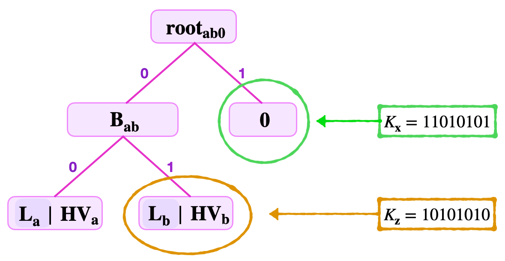

<b> Figure 10: Key Not Set Example </b>

##### Case 2: When the key leads to an existing leaf

Consider again the SMT depicted in Figure 10 above, and suppose that the prover claims that the key $K_{\mathbf{z}} = 10101010$ is set.

The verifier is given; the key $K_{\mathbf{z}} = 10101010$, the Remaining Key $\text{RK}_{\mathbf{z}} = 101010$, the least-significant key-bit $\text{kb}_0 = 0$, the second least-significant key-bit $\text{kb}_{\mathbf{1}} = 1$, and the siblings  $\mathbf{{S}_{1}} = \mathbf{L}_{a}$  and  $\mathbf{{S}_{2}} = \mathbf{0}$.

When navigating the tree from $\mathbf{{root}_{ab0}}$, using the key-bits $\text{kb}_{\mathbf{0}} = 0$ and $\text{kb}_{\mathbf{1}} = 1$, and with reference to Figure 10 above,

- the key-bit $\text{kb}_{\mathbf{0}}  = 0$ leads to the branch $\mathbf{{B}_{\mathbf{ab}}}$, 

- then from $\mathbf{{B}_{\mathbf{ab}}}$, the key-bit  $\text{kb}_{\mathbf{1}} = 1$ leads to the leaf $\mathbf{L}_\mathbf{b}$, which is the leaf circled in brown in Figure 9 above.

Since the key navigates to a leaf, the verifier's task is to prove two things simultaneously;

1. The leaf is in the SMT described in Figure 10, and 
2. The Remaining Key at the leaf $\mathbf{L}_\mathbf{b}$ is different from the Remaining Key supplied by the prover.

In proving that $\mathbf{L}_{\mathbf{b}}$ is indeed in the tree, the verifier does the following;

**Checks the root**:

(a)	Computes the hash of the hashed-value, $\mathbf{ \tilde{L} }_{\mathbf{b}} = \mathbf{H_{leaf}} ( \text{RK}_{\mathbf{b}} \| \text{HV}_{\mathbf{b}} )$, 

(b)	Uses the first sibling to compute, $ \mathbf{{\tilde{B}}_{\mathbf{ab}}} = \mathbf{H_{noleaf}} \big( \mathbf{L}_{\mathbf{a}} \| \mathbf{ \tilde{L}}_{\mathbf{b}} \big)$, 

(c)	Then, uses the second sibling to compute the root, $\mathbf{\tilde{root}}_{ab0} = \mathbf{H_{noleaf}} \big( \mathbf{{\tilde{B}}_{\mathbf{ab}}} \| \mathbf{0} \big)$. 

(d)	Completes the root-check by testing equality, $ \mathbf{\tilde{root}}_{ab0} = \mathbf{{root}}_{ab0}$.  

Simultaneously,

**Checks the keys**: 

The verifier takes the two Remaining Keys $\text{RK}_{\mathbf{x}}$ and $\text{RK}_{\mathbf{b}}$, and the key-bits $\text{kb}_0$ and $\text{kb}_{\mathbf{1}}$;

(a)	Concatenates them as, $\tilde{K}_{\mathbf{x}} = \text{RK}_{\mathbf{x}} \| \text{kb}_0 \| \text{kb}_{\mathbf{1}}$ and $\tilde{K}_{\mathbf{b}} = \text{RK}_{\mathbf{b}} \| \text{kb}_0 \| \text{kb}_{\mathbf{1}}$,

(b)	Checks $\tilde{K}_{\mathbf{x}} = K_{\mathbf{x}}$ and $\tilde{K}_{\mathbf{b}} = K_{\mathbf{b}}$, and

(c)	Finally shows the inequality, $\tilde{K}_{\mathbf{x}} \neq K_{\mathbf{b}}$.

This proves that the key $K_{\mathbf{x}}$ is not set.

*Remark*: The last check, where the verifier checks inequality of keys, turns out to be very expensive to implement. A much more smarter method is used in the Storage State Machine. 

### The UPDATE Operation 

The UPDATE operation does not change the topology of the tree. When carrying out the UPDATE, it is therefore important to retain all labels of nodes.

**The UPDATE process** entails the following;

First, the verifier needs to be provided with the following data; The remaining key $\text{RK}$, the least-significant key-bits, the new value, the old value, the old root and the siblings.

**Step 1.** ***Checking a READ*** of the current value with the old root. That is, checking that the leaf exists in the tree, and it was included in calculating the old root.

**Step 2.** ***Recomputing (updating) all nodes along the path***, from the leaf to the root, as well as computing the new root with the newly updated nodes.

The verifier can continue with **Step 2** only if all the checks in **Step 1** pass verification.

For the UPDATE operation, **Step 1** is exactly the same as the READ operation. We therefore focus on illustrating **Step 2**. 

#### Example 6. UPDATE - Step 2

Suppose the set key is $K_{\mathbf{c}} = 10110100$ corresponding to the old value $V_{\mathbf{c}}$, and the new value is $V_\mathbf{new}$.

The verifier is provided with the following data;

​	(a)	the $\text{RK}_{\mathbf{c}} = 10110$, 

​	(b)	the least-significant key-bit $\text{kb}_0 = 0$, 

​	(c)	the second least-significant key-bit  $\text{kb}_1 = 0$, 

​	(d)	the third least-significant key-bit  $\text{kb}_2 = 1$, 

​	(e)	the old hashed value $\text{HV}_{\mathbf{c}}$,

​	(f)	the old root  $\mathbf{{root}_{ab..f }}$ , and 

​	(g)	the siblings  $\mathbf{{S}_{1}} = \mathbf{{S}_{\mathbf{ab}}}$,   $\mathbf{{S}_{2}} = \mathbf{{L}_{d}}$  and  $\mathbf{{S}_{3}} = \mathbf{{S}_{\mathbf{ef}}}$. 

Consider the SMT given in Figure 11 below.

<b> Figure 11: Value UPDATE Example </b>

The required **Step 2** of the UPDATE operation involves, 

(a)	Computing the hash of the new value $V_\mathbf{new}$ as;  $\text{HV}_{\mathbf{new}} = \mathbf{H_{noleaf}}(V_\mathbf{new})$,  

(b)	Forming the new leaf by again hashing the hashed value $\text{HV}_{\mathbf{new}}$ as;  $\mathbf{ \tilde{L} }_{\mathbf{new}} = \mathbf{H_{leaf}}( \text{RK}_{\mathbf{new}} \| \text{HV}_{\mathbf{new}} )$, 

(c)	Using the first sibling  $\mathbf{{S}_{1}} = \mathbf{{S}_{\mathbf{ab}}}$  to compute,  $ \mathbf{{\bar{B}}_{abc}} = \mathbf{H_{noleaf}} \big( \mathbf{{S}_{\mathbf{ab}}} \| \mathbf{ \tilde{L}}_{\mathbf{new}} \big)$, 

(d)	Again, using the second sibling  $\mathbf{{S}_{2}} = \mathbf{{L}_{d}}$  to compute,  $ \mathbf{{\bar{B}}_{\mathbf{abcd}}} = \mathbf{H_{noleaf}} \big( \mathbf{{\bar{B}}_{abc}} \| \mathbf{{L}_{d}} \big)$, 

(e)	Then, uses the third sibling  $\mathbf{{S}_{3}} = \mathbf{{S}_{\mathbf{ef}}}$  to compute the root,  $\mathbf{{{root}}_{\mathbf{new}}} = \mathbf{H_{noleaf}} \big( \mathbf{{\bar{B}}_{\mathbf{abcd}}} \| \mathbf{{S}_{\mathbf{ef}}} \big)$. 

Note that the key-bits are not changed. Therefore, replacing the following old values in the SMT,
$$
\text{HV}_\mathbf{c},\ \ \mathbf{{B}_{abc}},\ \ \mathbf{{B}_{abcb}},\ \ \mathbf{{root}_{ab..f } },
$$
with the new ones,
$$
\text{HV}_\mathbf{new},\ \ \mathbf{{\bar{B}}_{abc}},\ \ \mathbf{{\bar{B}}_{abcb}},\ \ \mathbf{{root}_{new } },
$$
respectively, completes the UPDATE operation.

### The CREATE Operation

The CREATE Operation adds a new leaf $\mathbf{L_{\mathbf{new}}}$ to the SMT in order to insert and store a new key-value pair $( \mathbf{{K_{new}}} , \mathbf{V_{\mathbf{new}}} )$ at $\mathbf{L_{\mathbf{new}}}$, where the key $\mathbf{K_{new}} $ was never used in the SMT and thus is uniquely associated with the leaf $\mathbf{L_{new}}$.

When navigating from the root, the new key $\mathbf{K_{new}}$ can lead to either a zero node or an existing leaf. This results in two scenarios.

#### Case 1: New Key Navigates To A Zero Node

That is, the first  $l$  least-significant bits of the key $\mathbf{K_{new}}$ leads to a zero node, where  $l$  is the *levels to root* of the zero node.

The first step is to double-check that indeed the node is a zero node. That is, the verifier performs a Merkle proof starting with either $\mathbf{H_{noleaf}} ( \mathbf{S_1} \| \mathbf{0} )$ or $\mathbf{H_{noleaf}} ( \mathbf{0} \| \mathbf{S_1} )$, depending on whether the sibling of the zero-node is on the right (the edge corresponding to a key-bit $1$) or on the left (the edge corresponding to a key-bit $0$), respectively.

Once it is established that the new key $\mathbf{K_{new}}$ has led to a zero node, the verifier simply changes the zero node to the leaf $\mathbf{L_{new}}$ that stores the value $\mathbf{V_{new}}$. 

The CREATE operation, in this case, therefore boils down to an UPDATE operation on the zero node. It amounts to;

- Computing the hash of the new value $V_\mathbf{new}$ as,  $\text{HV}_{\mathbf{new}} = \mathbf{H_{noleaf}}(V_\mathbf{new})$, 
- Then forming the new leaf, $\mathbf{L_{new}} = \mathbf{H_{leaf}}( \text{RK}_{\mathbf{new}} \| \text{HV}_{\mathbf{new}})$,
- Recomputing all the nodes along the path climbing from the leaf $\mathbf{L_{new}}$ to the root, including computing the new root.

#### Example 7. CREATE Operation at a Zero Node

Suppose a new leaf with the key-value pair $\big(K_{\mathbf{new}}, \text{V}_{\mathbf{new}}\big)$, where $K_{\mathbf{new}} = 11010110$, needs to be created.

As illustrated in Figure 12 below, the two least-significant key-bits $\text{kb}_0 = 0$ and $\text{kb}_1 = 1$, lead to a zero node. That is, navigating from the root;

​	(a)	The lsb, $\text{kb}_{0} = 0$  leads to the node $\mathbf{{B}_{ab0}}$, 

​	(b)	Whilst the second lsb, $\text{kb}_{1} = 1$  leads to a zero node. 

At this stage the verifier checks if this is indeed a zero node; 

1. First he computes  $ \mathbf{{\tilde{B}}_{ab0}} = \mathbf{H_{noleaf}} \big( \mathbf{{S}_{\mathbf{ab}}} \| \mathbf{0} \big) $. 
2. Then he computes  $\mathbf{{\tilde{root}}_{ab0c}} = \mathbf{H_{noleaf}} \big( \mathbf{{\tilde{B}}_{ab0}} \| \mathbf{L_{c}} \big) $. 
3. And, checks if  $\mathbf{{\tilde{root}}_{ab0c}}$  equals  $ \mathbf{{root}_{ab0c}} $. 

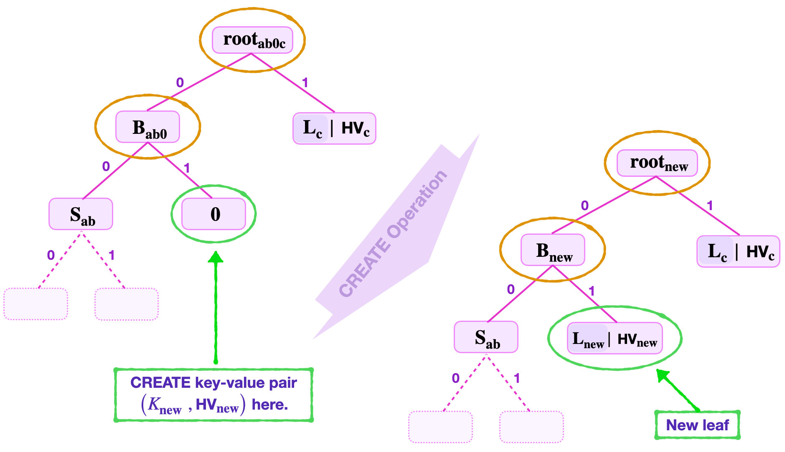

<b> Figure 12: CREATE Operation - Zero Node </b>

Once the zero-value is checked, the verifier now creates a non-zero leaf with the key-value pair $\big( \mathbf{K_{new}} , \text{HV}_{\mathbf{new}}\big)$.

1. He computes the hash of $\text{V}_{\mathbf{new}}$ as, $\text{HV}_{\mathbf{new}} = \mathbf{H_{noleaf}}(V_\mathbf{new})$, 
2. He then forms the leaf  $\mathbf{L_{new}} =  \mathbf{H_{leaf}}(  \text{RK}_{\mathbf{new}} \| \text{HV}_{\mathbf{new}})$, 
3. Also computes  $\mathbf{B_{new}} =  \mathbf{H_{noleaf}} ( \mathbf{{S}_{\mathbf{ab}}} \| \mathbf{L_{new}})$, 
4. And computes  $\mathbf{{root}_{new}} =  \mathbf{H_{noleaf}} ( \mathbf{B_{new}} \| \mathbf{L_{c}} )$.

An UPDATE of these values; the branch $\mathbf{B_{ab0}}$ to $\mathbf{B_{new}}$ and the old root $\mathbf{{root}_{ab0c}}$ to $\mathbf{{root}_{new}}$; completes the CREATE operation.

Note that inserting a new key-value pair at a zero node does not change the topology of the tree.

#### Case 2: New Key Navigates To A Non-Zero Leaf

That is, the first $\mathbf{l}$ least-significant bits of the key $\mathbf{K_{new}}$ leads to a non-zero leaf $\mathbf{L_z}$, where $\mathbf{l}$ is $\mathbf{L_z}$'s number of *levels to root*. This means, the keys $\mathbf{K_{new}}$ and $\mathbf{K_{z}}$ share a common string of least-significant key-bits, which is $\mathbf{l}$ bits long.

Step 1: **Checking Leaf Inclusion**

The first step is to double-check that indeed the value $V_\mathbf{z}$ stored at the leaf $\mathbf{L_z}$ is indeed included in the root. 

That is, the verifier performs a Merkle proof starting with either $\mathbf{H_{noleaf}} ( \mathbf{S_1} \| \mathbf{L_z} )$ or $\mathbf{H_{noleaf}} ( \mathbf{L_z} \| \mathbf{S_1} )$, for some sibling $\mathbf{S_1}$. The ordering of the hash arguments depends on whether the sibling of the leaf $\mathbf{L_z}$ is on the left (the edge corresponding to a key-bit $0$) or on the right (the edge corresponding to a key-bit $1$), respectively. The check of value-inclusion gets completed by climbing the tree as usual.

Once it is established that the value $V_\mathbf{z}$ stored at the leaf $\mathbf{L_z}$ is included in the root, the new leaf $\mathbf{L_{new}}$ storing the key-value pair can now be created. 

Step 2: **Extending The SMT** 

Since it is not permissible for two distinct non-zero leaves, $\mathbf{L_{new}}$ and $\mathbf{L_z}$, to share a tree-address, a CREATE Operation at $\mathbf{L_z}$ results in extending the tree; by adding a new branch $\mathbf{B_{ext1}}$ at the tree-address where $\mathbf{L_z}$ has been positioned.

As discussed earlier in this document, when building binary SMTs, the aim is to find a tree-address for the new leaf $\mathbf{L_{new}}$ which differs from the tree-address of any existing leaf $\mathbf{L_z}$.

So then, for as long as the next corresponding key-bits between $\mathbf{K_{new}}$ and $\mathbf{K_{z}}$ coincide, a new extension branch needs to be formed.

Here's the general procedure; 

1. Start with the next least-significant key-bits, $\text{kb}_\mathbf{(l+1)new}$ and $\text{kb}_\mathbf{(l+1)z}$ , and check if  $\text{kb}_\mathbf{(l+1)new} = \text{kb}_\mathbf{(l+1)z}$ or not.
2. If they are not the same (i.e., if $\text{kb}_\mathbf{(l+1)new} \neq \text{kb}_\mathbf{(l+1)z}$), then one new extension branch $\mathbf{B_{ext1}}$ with $\mathbf{L_{new}}$ and $\mathbf{L_{z}}$ as its child-nodes, suffices.
3. But, if $\text{kb}_\mathbf{(l+1)new} = \text{kb}_\mathbf{(l+1)z}$ , then another extension branch $\mathbf{B_{ext2}}$ needs to be formed. And, the first extension branch $\mathbf{B_{ext1}}$ is made a parent-node to both $\mathbf{B_{ext2}}$ and a NULL node "$\mathbf{0}$". The key-bit $\text{kb}_\mathbf{(l+1)new}$ determines whether the NULL node "$\mathbf{0}$" is on the left or the right.
4. One then continues with the next least-significant key-bits, $\text{kb}_\mathbf{(l+2)new}$ and $\text{kb}_\mathbf{(l+2)z}$, and checks if $\text{kb}_\mathbf{(l+2)new} = \text{kb}_\mathbf{(l+2)z}$ or not.
5. If $\text{kb}_\mathbf{(l+2)new} \neq \text{kb}_\mathbf{(l+2)z}$ , then the second extension branch $\mathbf{B_{ext2}}$, with $\mathbf{L_{new}}$ and $\mathbf{L_{z}}$ as its child-nodes, completes the CREATE operation.
6. However, if $\text{kb}_\mathbf{(l+2)new} = \text{kb}_\mathbf{(l+2)z}$ , then a third extension branch $\mathbf{B_{ext3}}$ is formed. And, as before, the second extension branch $\mathbf{B_{ext2}}$ is made a parent-node to both $\mathbf{B_{ext3}}$ and a NULL node "$\mathbf{0}$". And similarly, the key-bit $\text{kb}_\mathbf{(l+2)new}$ determines whether the NULL node "$\mathbf{0}$" is on the left or the right.
7. This procedure (of extending the tree) continues until, $\text{kb}_\mathbf{(l+j)new} \neq \text{kb}_\mathbf{(l+j)z}$ for some $j > 2$. In which case, the $\mathbf{(l + j)}$-th extension branch $\mathbf{B_{ext(l + j)}}$, with the  $\mathbf{L_{new}}$ and $\mathbf{L_{z}}$ as its child-nodes, completes the CREATE operation.

Step 3: **UPDATE of Values**

The CREATE Operation is actually only complete once all the values on the navigation path from the new root to the new leaf are updated.

##### Example 8. CREATE Operation with a Single Branch Extension

Suppose a leaf needs to be created to store a new key-value pair $\big( {K_{\mathbf{new}}\ } , V_\mathbf{{new}} \big) $, where $K_{\mathbf{new}} = 11010110$. 

Consider the SMT shown in Figure 13(a) below.

In this example, navigation using the least-significant key-bits, $\text{kb}_\mathbf{0} = 0$ and $\text{kb}_\mathbf{1} = 1$, leads to an existing leaf $\mathbf{L_{\mathbf{c}}}$. And the key-value pair $(V_\mathbf{\mathbf{c}}, \text{HV}_\mathbf{\mathbf{c}})$ stored at $\mathbf{L_{\mathbf{c}}}$ has the key $K_{\mathbf{c}} = 11010010$.

**Value-Inclusion Check**

A value-inclusion check of $V_\mathbf{\mathbf{c}}$ is performed before creating any new leaf. Since this amounts to a READ Operation, which has been illustrated in previous examples, we omit how this is done here. 

Once $V_\mathbf{\mathbf{c}}$ passes the check, the CREATE Operation continues by inserting the new leaf. 

**New Leaf Insertion**

In this example, the new leaf $\mathbf{L_{new}}$ cannot be inserted at the key-address `01` where $\mathbf{L_{\mathbf{c}}}$ is positioned. A branch extension $\mathbf{{B}_{ext}}$ must therefore be done at the address `01` with the leaves $\mathbf{L_{new}}$ and $\mathbf{L_{c}}$ as child-nodes.

Since the third least-significant key-bits of $K_{\mathbf{new}}$ and $K_{\mathbf{c}}$ are not the same, $\text{kb}_\mathbf{2new} = 1$ and $\text{kb}_\mathbf{2c} = 0$, the addresses `110` and `010` of the leaves $\mathbf{L_{new}}$ and $\mathbf{L_{c}}$, respectively, are distinct.

Therefore, no further extension is necessary. And the CREATE Operation is complete by updating all the values on the navigation path.

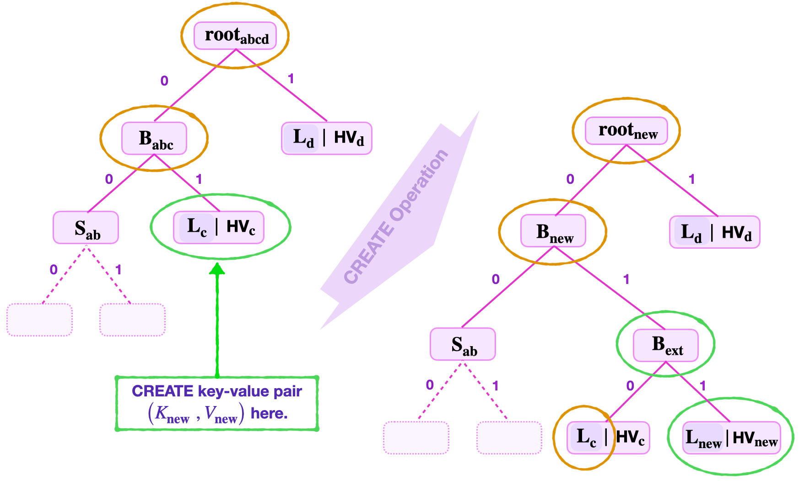

<b> Figure 13(a): CREATE Operation - Non-zero Leaf Node </b>

The next process, after forming the branch extension, is to UPDATE all the nodes along the path from the root to the new leaf $\mathbf{L_{new}}$. The verifier follows the steps of the UPDATE operation to accomplish this. 

**UPDATE of SMT Values** 

The verifier computes the following,

1. The hashed value, $\text{HV}_{\mathbf{new}} = \mathbf{H_{noleaf}}(V_\mathbf{new})$, 
2. The new leaf,  $\mathbf{L_{new}} = \mathbf{H_{leaf}} ( \text{RK}_{\mathbf{new}} \| \text{HV}_{\mathbf{new}})$, 
3. Then,  $\mathbf{B_{ext}} = \mathbf{H_{noleaf}} ( \mathbf{L_{c}} \| \mathbf{L_{new}})$, 
4. Again,  $\mathbf{B_{new}} = \mathbf{H_{noleaf}}( \mathbf{S_{ab}} \| \mathbf{B_{ext}} )$, 
5. And finally computes,  $\mathbf{{root}_{new}} = \mathbf{H_{noleaf}}( \mathbf{B_{new}} \| \mathbf{L_{d}} )$.

This illustrates how the CREATE Operation is performed at a non-zero leaf, when only one branch extension is required.

##### Example 9. CREATE Operation with **Multiple Branch Extensions** 

This example provides an illustration of the CREATE Operation at a non-zero leaf, where more than one branch extensions are required.

Suppose a leaf must be created to store a new key-value pair $\big(K_{\mathbf{new}}, V_\mathbf{new}\big)$, where $K_{\mathbf{new}} = 11010110$.

Consider the SMT shown in Figure 13(b) below.

Navigating the tree by using the least-significant key-bits, $\text{kb}_\mathbf{0} = 0$ and $\text{kb}_\mathbf{1} = 1$, leads to an existing leaf $\mathbf{L_{\mathbf{c}}}$. In this example, suppose the key-value pair $(K_{\mathbf{c}} , \text{HV}_\mathbf{\mathbf{c}})$ stored at $\mathbf{L_{\mathbf{c}}}$ has the key $K_{\mathbf{c}} = 11100110$.

**Value-Inclusion Check**

Before creating the new leaf, it is important to first check if $V_\mathbf{\mathbf{c}}$ is indeed included in the root, $\mathbf{root}_\mathbf{abcd}$. Since this amounts to performing a READ Operation, which has been illustrated in previous examples, we omit here how this is done. 

Once $V_\mathbf{\mathbf{c}}$ passes the value-inclusion check, the CREATE Operation proceeds with inserting the new leaf. 

**New Leaf Insertion**

Note that the first and second least-significant key-bits for both $K_\mathbf{new}$ and $K_\mathbf{c}$ are the same. That is, 
$$
\text{kb}_\mathbf{0new} = 0 = \text{kb}_\mathbf{0c}  \text{\quad and \quad } \text{kb}_\mathbf{1new} = 1 = \text{kb}_\mathbf{1c}.
$$
As a result, the new leaf $\mathbf{L_{new}}$ cannot be inserted at the key-address `01`, where $\mathbf{L_{\mathbf{c}}}$ is positioned. An extension branch $\mathbf{{B}_{ext1}}$ is formed at the tree-address `01`. 

But, can the leaves $\mathbf{L_{new}}$ and $\mathbf{L_{c}}$ be child-nodes to $\mathbf{{B}_{ext1}}$?

Since the third least-significant key-bits of $K_\mathbf{new}$ and $K_\mathbf{c}$ are the same; i.e., $\text{kb}_\mathbf{2new} = 1 = \text{kb}_\mathbf{2c}$; leaves $\mathbf{L_{new}}$ and $\mathbf{L_{c}}$ cannot be child-nodes to $\mathbf{{B}_{ext1}}$.

Another extension branch $\mathbf{{B}_{ext2}}$ is formed at the tree-address `011`.

Again, since the fourth least-significant key-bits of $K_\mathbf{new}$ and $K_\mathbf{c}$ are the same;  $\text{kb}_\mathbf{3new} = 0 = \text{kb}_\mathbf{3c}$ ; the leaves $\mathbf{L_{new}}$ and $\mathbf{L_{c}}$ cannot be child-nodes to $\mathbf{{B}_{ext2}}$.

A third extension branch $\mathbf{{B}_{ext3}}$ is needed at the tree-address `0110`.

In this case, the fifth least-significant key-bits of $K_\mathbf{new}$ and $K_\mathbf{c}$ are different; i.e.,  $\text{kb}_\mathbf{4new} = 1$ and $\text{kb}_\mathbf{4c} = 0$. 

The leaves $\mathbf{L_{new}}$ and $\mathbf{L_{c}}$ are now made child-nodes of the extension branch $\mathbf{{B}_{ext3}}$. See Figure 13(b) below.

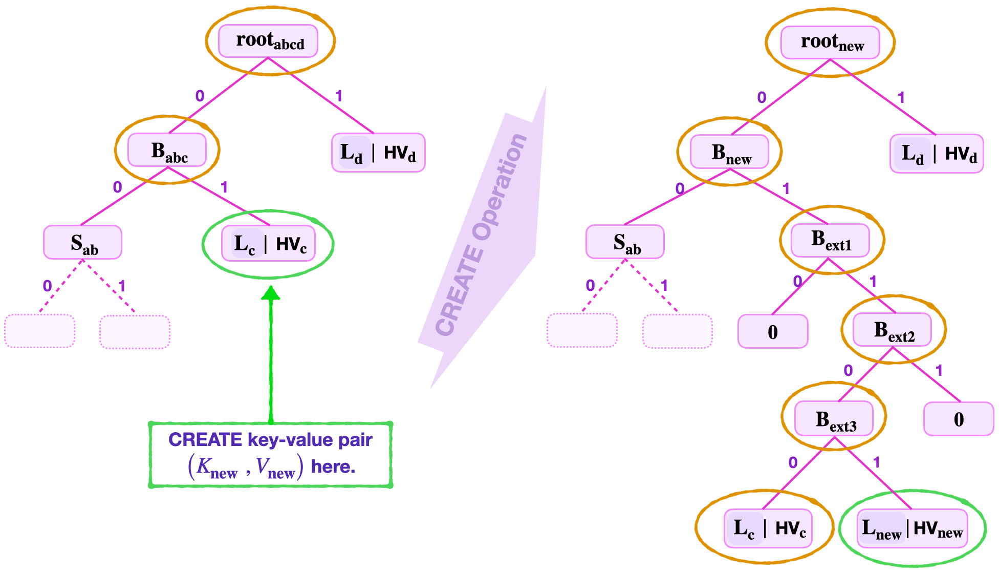

<b> Figure 13(b): CREATE Operation - Three Branch Extensions </b>

Once unique addresses for the key-value pairs $\big( K_{\mathbf{c}} , V_\mathbf{c} \big) $ and $\big( K_\mathbf{{new}} , V_{\mathbf{new}}\big)$  are reached, and the leaf $\mathbf{L_{new}}$ is inserted, all the nodes along the navigation path from the new leaf $\mathbf{L_{new}}$ to the root are updated as follows. 

The verifier computes,

1. The hash of the new value, $\text{HV}_\mathbf{new} = \mathbf{H_{noleaf}}(V_\mathbf{new})$,
2. The new leaf,  $\mathbf{L_{new}} = \mathbf{H_{leaf}} ( \text{RK}_{\mathbf{new}} \| \text{HV}_{\mathbf{new}})$, 
3. Then,  $\mathbf{B_{ext3}} = \mathbf{H_{noleaf}}( \mathbf{L_{c}} \| \mathbf{L_{new}})$, 
4. Followed by $\mathbf{B_{ext2}} = \mathbf{H_{noleaf}}( \mathbf{B_{ext3}}  \| \mathbf{0} )$,
5. And,  $\mathbf{B_{ext1}} = \mathbf{H_{noleaf}}( \mathbf{0} \| \mathbf{B_{ext2}} )$,
6. Again,  $\mathbf{B_{new}} = \mathbf{H_{noleaf}}( \mathbf{S_{ab}} \| \mathbf{B_{ext2}} )$, 
7. And finally computes,  $\mathbf{{root}_{new}} = \mathbf{H_{noleaf}}( \mathbf{B_{new}} \| \mathbf{L_{d}} )$.

This completes the CREATE operation at an existing leaf where several branch extensions are needed. 

The CREATE operation at a non-leaf node clearly changes the topology of the tree.

### The DELETE/REMOVE Operation 

The DELETE Operation refers to a removal of a certain key-value pair from a binary SMT. It is in fact the reverse of the CREATE Operation.

There are two types of scenarios that can occur when executing a DELETE Operation.

There is a scenario where a DELETE Operation is equivalent to an UPDATE Operation of a non-zero leaf to a NULL leaf. In this case the topology of the SMT does not change. This occurs when the leaf being deleted has a non-zero sibling-node.

On the other hand, a DELETE Operation can be tantamount to the reverse of a CREATE Operation where extension branches are removed from the tree. The topology of the SMT can drastically change. This scenario occurs when the leaf being removed has a zero sibling-node.

A DELETE Operation involves two main steps;

***Step 1***: A READ of the value to be deleted is executed. That is; 

​	(a)	Navigating to the value, 

​	(b)	Checking if the value is included in the root, and 

​	(c)	Checking if the given key (reconstructed from the given Remaining Key and the least-significant key-bits) matches the key at the leaf (reconstructed from the Remaining Key found at the leaf and the given key-bits).

***Step 2***: This step depends on whether the sibling of the *leaf to be deleted* is zero or not; 

​	(a)	If the **sibling is not a zero node**, an UPDATE to a zero is performed.

​	(b)	If the **sibling is a zero-node**, an UPDATE to a zero is performed and the parent-node is turned into a NULL node with no child-nodes.

#### Case 1: DELETE Operation - Leaves With Non-Zero Siblings

Consider a DELETE of a key-value pair $\big(K_{\mathbf{b}} , V_\mathbf{b} \big)$ where its leaf $\mathbf{L_b}$ has a non-zero node sibling.

Suppose the data provided includes; the Remaining Key $\tilde{\text{RK}}_{\mathbf{b}}$, the least-significant key-bits $\text{kb}_0 = 0$ and $\text{kb}_1 = 1$, the root $\mathbf{{root}_{abc}}$, and the sibling $\mathbf{L_a}$ which is not a zero node and the leaf $\mathbf{L_c}$.

With reference to Figure 14(a) below, navigation leads to the leaf $\mathbf{L_b}$.

Next, perform a Merkle proof to check if the hashed value $\text{HV}_\mathbf{b}$ at $\mathbf{L_b}$ is included in the given root;

- Compute $\tilde{\mathbf{L}}_\mathbf{b} = \mathbf{H_{leaf}} ( \text{RK}_{\mathbf{b}} \| \text{HV}_\mathbf{b} ) $ 
- Then $ \tilde{\mathbf{B}}_\mathbf{ab} = \mathbf{H_{noleaf}} ( \mathbf{L_a} \| \tilde{\mathbf{L}}_\mathbf{b})$
- And,  $\tilde{\mathbf{root}}_\mathbf{abc} = \mathbf{H_{noleaf}} ( \tilde{\mathbf{B}}_\mathbf{ab}  \| \mathbf{L_c} )$
- Check if $\tilde{\mathbf{root}}_\mathbf{abc} $ equals $\mathbf{{root}_{abc}}$.

Simultaneously, check if $\tilde{K}_{\mathbf{b}}$ equals $\text{K}_{\mathbf{b}}$, where  $\tilde{K}_{\mathbf{b}} =  \tilde{\text{RK}}_{\mathbf{b}} \| \text{kb}_1 \| \text{kb}_0$  and  $\text{K}_{\mathbf{b}} =   \text{RK}_{\mathbf{b}} \| \text{kb}_1 \| \text{kb}_0 $  are keys reconstructed while climbing the tree.

Since the sibling $\mathbf{L_a}$ is not a zero node, the hashed value $\text{HV}_\mathbf{b}$ found at the leaf $\mathbf{L_b}$ is updated to a zero. And the values along the navigation path are also updated accordingly. That is,

- The leaf $\mathbf{L_b}$ is set to "$\mathbf{0}$", a zero node.
- The parent-node is now, $ \mathbf{B_{a0}} = \mathbf{H_{noleaf}} ( \mathbf{L_a} \| \mathbf{0}  )$.
- And, the new root, $\mathbf{{root}_{abc}} =   \mathbf{H_{noleaf}}(\mathbf{B_{a0}} \| \mathbf{L_a})$. 

See the above DELETE Operation illustrated in Figure 13(a) below, and notice how the SMT maintains its original shape. 

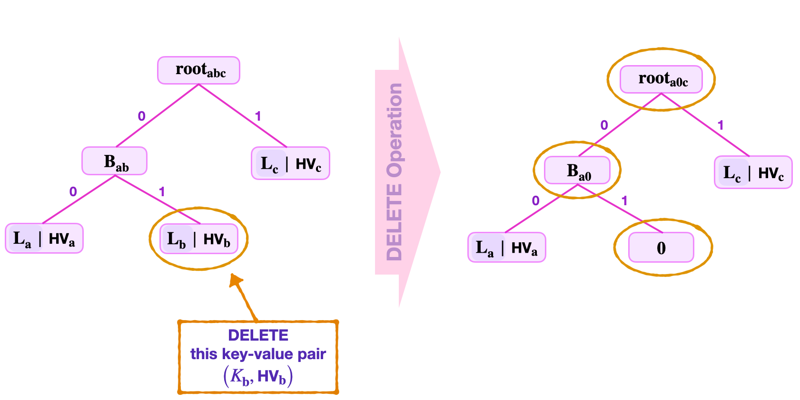

<b> Figure 14(a): DELETE Operation - Non-Zero Sibling </b>

#### Case 2: DELETE Operation - Leaves With Zero Siblings

Consider deleting a key-value pair $\big(K_{\mathbf{c}} , V_\mathbf{c} \big)$ where its leaf $\mathbf{L_c}$ has a zero-node sibling.

As in Case 1 above, suppose the data provided includes; the Remaining Key $\tilde{\text{RK}}_{\mathbf{c}}$, the least-significant key-bits $\text{kb}_0 = 0$, $\text{kb}_1 = 1$ and $\text{kb}_2 = 1$, the root $\mathbf{{root}_{a0cd}}$, and the sibling "$\mathbf{0}$" which is a zero node, and the leaves $\mathbf{L_a}$ and $\mathbf{L_d}$.

With reference to Figure 14(b) below, navigation leads to the leaf $\mathbf{L_c}$.

The READ step in this case is similar to what is seen in Case 1. 

The UPDATE step depends on the sibling of $\mathbf{L_c}$. Since the sibling is "$\mathbf{0}$", an UPDATE of $\mathbf{L_c}$ to zero results in the branch $\mathbf{B_{0c}}$ having two zero nodes as child-nodes. Since $\mathbf{H_{noleaf}} ( \mathbf{0} \| \mathbf{0}) = 0$ , it is therefore expedient to turn the branch $\mathbf{B_{0c}}$ into a zero node with no child-nodes. 

That is, the UPDATE step of this DELETE Operation concludes as follows;

- The original branch $\mathbf{B_{0c}}$ is now "$\mathbf{0}$", a zero node.
- The parent-node is now, $ \mathbf{B_{a0}} = \mathbf{H_{noleaf}} ( \mathbf{L_a} \| \mathbf{0}  )$.
- And, the new root, $\mathbf{{root}_{a0d}} =   \mathbf{H_{noleaf}}(\mathbf{B_{a0}} \| \mathbf{L_d})$. 

Notice that, in this example, the DELETE Operation alters the topology of the SMT, as seen in Figure 13(b) below.

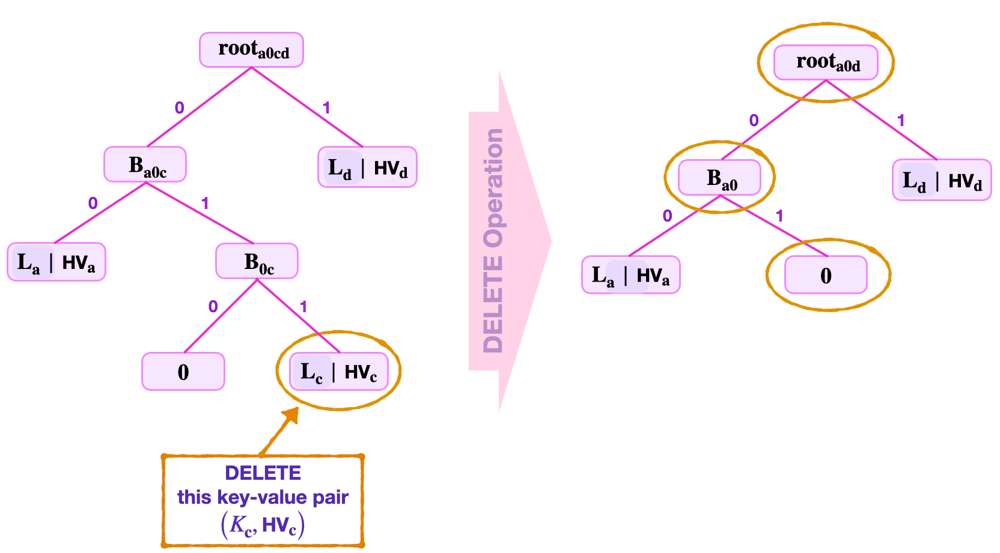

<b> Figure 14(b): DELETE Operation - Zero Sibling </b>

### Concluding Basic Operations 

The operations discussed in this section are in fact the very actions the Main State Machine will instruct the Storage State Machine to perform.

The 'prover' and the 'verifier', as used in the above explanations, can loosely be interpreted as the Executor of the Storage State Machine and the Storage SM's PIL code, respectively. The zero-knowledge Assembly (zkASM) of the Storage SM plays the facilitator's role. The zkASM is the interpreter between the Storage SM and the Main State Machine, also between the Storage SM and the POSEIDON State Machine. 

The two hash functions used in building the Storage binary SMTs, are special versions of the POSEIDON family of hash functions.

What's left is specifying parameters such as the actual key-length used in the Storage State Machine, how keys and paths are created, as well as cryptographic primitives utilised like the exact POSEIDON hash functions.

## zkProver Storage Parameters

In the Storage Storage, the keys and values are strings of 256 bits.

Keys will henceforth be represented as 256-bit unsigned integers, which are quadruples of 64-bit field elements; e.g., $\text{Key}_{\mathbf{0123}} = \big( \text{Key}_{\mathbf{0}} , \text{Key}_{\mathbf{1}} , \text{Key}_{\mathbf{2}} , \text{Key}_{\mathbf{3}} \big)$, where each $\text{Key}_{\mathbf{i}} \in \mathbb{F}_p$, where  $p = 2^{64} - 2^{32} + 1$. 

Although hashed-values are also 256-bit long and are used in quadruple form, 'committed' values are 256-bit long and are often expressed as octets. It is mainly due to the POSEIDON SM convention, where 256-bit committed values are input as, $\text{V}_{\mathbf{01..7}} = \big( \text{V}_{\mathbf{0}} , \text{V}_{\mathbf{1}} , \text{V}_{\mathbf{2}} , \dots , \text{V}_{\mathbf{7}} \big)$, and each 32-bit $V_{\mathbf{j}}$ chunk of bits.

In fact, almost every other 256-bit value in the Storage is expressed in the form of a quadruple of 64-bit field elements.

### Creating Keys And Paths

#### How Keys Are Created

In the key-value pair SMT context of our storage design, a key uniquely identifies a leaf. And it is because, although values can change, keys do not. 

Keys must consequently be generated deterministically, and in such a way that there are no collisions. That is, there must be a one-to-correspondence between keys and leaves.

A collision-resistant hash function is therefore the best tool for generating keys. And the most convenient way to generate keys is by hashing some specific information so that the resultant hash uniquely identifies the leaf. The *specific Information* used for generating keys is the *Ethereum Address* and some constant. The $\text{POSEIDON}$ Hash is again used for this purpose.

#### Constructing Navigation Paths

A path refers to the edges traversed from the root to a leaf. Since the SMTs are binary, all edges can be thought of, as labelled with either a bit "0" or "1"; Edges to the left labelled with a bit "0", while edges to the right are labelled with a bit "1".

Paths are therefore strings of bits, and are derived from keys in a very specific way.

First of all, every key can be thought of as a quadruple, $\text{Key}_{\mathbf{0123}} = \big( \text{Key}_{\mathbf{0}} , \text{Key}_{\mathbf{1}} , \text{Key}_{\mathbf{2}} , \text{Key}_{\mathbf{3}} \big) \in \mathbb{F}_{p}^4$. Denote each key part $\text{Key}_{\mathbf{i}}$ bit-wise as, 
$$
\text{Key}_{\mathbf{0}} = k_{\mathbf{0,63}\ } k_{\mathbf{0,62}\ } \dots k_{\mathbf{0,2}\ } k_{\mathbf{0,1}\ } k_{\mathbf{0,0} },\ \ \text{Key}_{\mathbf{1}} = k_{\mathbf{1,63}\ } k_{\mathbf{1,62}\ } \dots k_{\mathbf{1,2}\ } k_{\mathbf{1,1}\ } k_{\mathbf{1,0} }, \\\text{Key}_{\mathbf{2}} = k_{\mathbf{2,63}\ } k_{\mathbf{2,62}\ } \dots k_{\mathbf{2,2}\ } k_{\mathbf{2,1}\ } k_{\mathbf{2,0} },\ \ \text{Key}_{\mathbf{3}} = k_{\mathbf{3,63}\ } k_{\mathbf{3,62}\ } \dots k_{\mathbf{3,2}\ } k_{\mathbf{3,1}\ } k_{\mathbf{3,0} },
$$
where the most-significant bit $\text{MSB}(\text{Key}_{\mathbf{i}}) = k_{\mathbf{i,63}\ }$ and the least-significant bit $\text{LSB}(\text{Key}_{\mathbf{i}}) = k_{\mathbf{i,0}}$, for each  $\mathbf{i} \in \{ \mathbf{0}, \mathbf{1}, \mathbf{2}, \mathbf{3} \}$.

The **Navigation Path** to the leaf corresponding to the key $\text{Key}_{\mathbf{0123}}$ is defined as the following string of shuffled key-bits;
$$
k_{\mathbf{0,0}\ } k_{\mathbf{1,0}\ } k_{\mathbf{2,0}\ } k_{\mathbf{3,0}\ } k_{\mathbf{0,1}\ } k_{\mathbf{1,1}\ } k_{\mathbf{2,1}\ } k_{\mathbf{3,1}\ } k_{\mathbf{0,2}\ } k_{\mathbf{1,2}\ } k_{\mathbf{2,2}\ } k_{\mathbf{3,2}\ }  \dots k_{\mathbf{0,62}\ }  k_{\mathbf{1,62}\ } k_{\mathbf{2,62}\ }  k_{\mathbf{3,62}\ }  k_{\mathbf{0,63}\ } k_{\mathbf{1,63}\ } k_{\mathbf{2,63}\ } k_{\mathbf{3,63} }.
$$
That is, the Navigation Path to the leaf corresponding to $\text{Key}_{\mathbf{0123}} $ is the string of bits composed of;

- The least-significant bits of the four key parts, $\text{Key}_{\mathbf{0}} , \text{Key}_{\mathbf{1}} , \text{Key}_{\mathbf{2}} , \text{Key}_{\mathbf{3}}$, appearing in the order of the key parts as: $k_{\mathbf{0,0}\ } k_{\mathbf{1,0}\ } k_{\mathbf{2,0}\ } k_{\mathbf{3,0}}$.
- Followed by the second least-significant bits of the four key parts, $\text{Key}_{\mathbf{0}} , \text{Key}_{\mathbf{1}} , \text{Key}_{\mathbf{2}} , \text{Key}_{\mathbf{3}}$, appearing in the order of the key parts as: $k_{\mathbf{0,1}\ } k_{\mathbf{1,1}\ } k_{\mathbf{2,1}\ } k_{\mathbf{3,1}}$. 
- Then the third least-significant bits of the four key parts, $\text{Key}_{\mathbf{0}} , \text{Key}_{\mathbf{1}} , \text{Key}_{\mathbf{2}} , \text{Key}_{\mathbf{3}}$, appearing in the order of the key parts as: $k_{\mathbf{0,2}\ } k_{\mathbf{1,2}\ } k_{\mathbf{2,2}\ } k_{\mathbf{3,2}}$.
- Up until the most-significant bits of the four key parts, $\text{Key}_{\mathbf{0}} , \text{Key}_{\mathbf{1}} , \text{Key}_{\mathbf{2}} , \text{Key}_{\mathbf{3}}$, appearing in the order of the key parts as: $k_{\mathbf{0,63}\ } k_{\mathbf{1,63}\ } k_{\mathbf{2,63}\ } k_{\mathbf{3,63} }$.

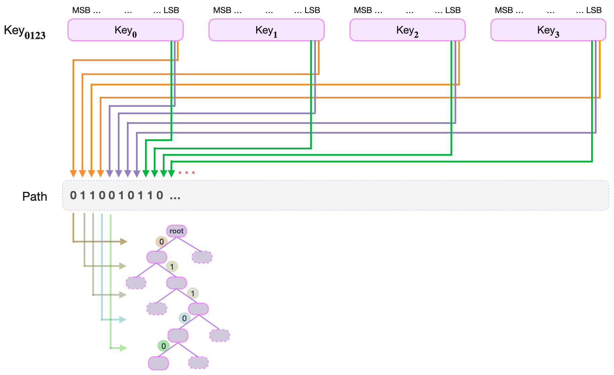

<b> Figure 15 : Navigation Path Derivation </b>

Note that, this construction ensures that in every quadruplet of consecutive path-bits there is a one-to-one correspondence between the bits and the four parts of the key, $\text{Key}_{\mathbf{0}} , \text{Key}_{\mathbf{1}} , \text{Key}_{\mathbf{2}} , \text{Key}_{\mathbf{3}}$. 

#### Reconstructing The Key From Path-Bits

When executing a basic operation such as an UPDATE of a value at a leaf, one has to reconstruct the key from the remaining key found at the leaf and the path-bits spent in navigating to the leaf.

Denote the remaining key as a quadruple,  $\text{RKey}_{\mathbf{0123}} = \big( \text{RKey}_{\mathbf{0}} , \text{RKey}_{\mathbf{1}} , \text{RKey}_{\mathbf{2}} , \text{RKey}_{\mathbf{3}} \big) $

Since the Path was constructed by shuffling key-bits from the four parts, $\text{Key}_{\mathbf{0}}$, $\text{Key}_{\mathbf{1}}$, $\text{Key}_{\mathbf{2}}$, $\text{Key}_{\mathbf{3}}$, one would expect the reverse-process (going from the Path-bits to the original key) to work just as easily. 

Perhaps taking the level $\text{lvl}$ of a leaf and reducing it *modulo 4*, should be sufficient to tell which part of the Remaining Key, $\text{RKey}_{\mathbf{i}}$, must the Path key-bit be appended to.

##### Example. Key Reconstruction

Suppose the leaf storing the key-value pair $\big( \text{Key}_{\mathbf{0123}}, \text{V}_{\mathbf{01..7}}  \big)$ is reached at level 7, the path-bits used are $0110101$, and the remaining key is $\text{RKey}_{\mathbf{0123}} = \big( \text{RKey}_{\mathbf{0}} , \text{RKey}_{\mathbf{1}} , \text{RKey}_{\mathbf{2}} , \text{RKey}_{\mathbf{3}} \big)$.

That is, the path-bits are  $\text{path-bit}_6 = 1$, $\text{path-bit}_5 = 0$, $\text{path-bit}_4 = 1$, $\text{path-bit}_3 = 0$, $\text{path-bit}_2 = 1$, $\text{path-bit}_1 = 1$ and $\text{path-bit}_0 = 0$.

So, in order to place $\text{path-bit}_6$, one first computes $7 \text{ modulo } 4$ to get $3$. Hence, the $\text{key-bit}_6$ must be appended to the third key part, $\text{RKey}_{\mathbf{2}}$.

Next, one climbs the tree to level $6$, where $\text{path-bit}_5 = 0$. One then computes $6 \text{ modulo } 4$ and gets $2$. The $\text{path-bit}_5$ must then be appended to the second key part, $\text{RKey}_{\mathbf{1}}$.

Again, one climbs the tree to level $5$, where $\text{path-bit}_4 = 1$. Computing  $5 \text{ modulo } 4$  yields $1$. The $\text{path-bit}_4$ is thence appended to the first key part, $\text{RKey}_{\mathbf{0}}$.

One then continues in the same fashion; 

$\text{Climbs the tree to level } 4. \text{ Computes }\ 4 \text{ modulo } 4 = 0. \text{ Appends path-bit to the fourth part, } \text{RKey}_{\mathbf{3}}.$
$\text{Climbs the tree to level } 3. \text{ Computes }\ 3 \text{ modulo } 4 = 3. \text{ Appends path-bit to the third part, } \text{RKey}_{\mathbf{2}}.$$\text{Climbs the tree to level } 2. \text{ Computes }\ 2 \text{ modulo } 4 = 2. \text{ Appends path-bit to the second part, } \text{RKey}_{\mathbf{1}}.$
$\text{Climbs the tree to level } 1. \text{ Computes }\ 1 \text{ modulo } 4 = 1. \text{ Appends path-bit to the first part, } \text{RKey}_{\mathbf{0}}.$

The next climb is to the root. The navigation path-bits have been exhausted, and the last append has actually completed reconstruction of the key.

##### Leaf Levels and Integers Modulo 4

It is clear, from the above example, that there is a one-to-one correspondence between the integers *modulo* 4 (i.e., Elements of the group $\mathbb{Z}_4 = \{ 0, 1, 2, 3 \}$) and remaining key parts $\text{RKey}_{\mathbf{0}} , \text{RKey}_{\mathbf{1}} , \text{RKey}_{\mathbf{2}} , \text{RKey}_{\mathbf{3}}$. 

That is, there is a mapping;
$$
1 \mapsto \text{RKey}_{\mathbf{0}},\ \ 2 \mapsto \text{RKey}_{\mathbf{1}},\ \  3 \mapsto \text{RKey}_{\mathbf{2}} \text{ and }\ 0 \mapsto \text{RKey}_{\mathbf{3}}.
$$
The quadruple structure of the path bits and the level of leaves therefore have a homomorphic relationship that can be described in terms of the cyclic group of integers modulo 4,  $\mathbb{Z}_4 = \{ 0, 1, 2, 3 \}$.

Since *addition modulo n* is an expensive computation in the state machine context, it is important to find a more efficient algorithm to achieve the same result.

##### Alternate Cyclic Group Of Order 4

In order to explore cyclic groups of order 4, take the vector  $\mathbf{x} = $ $(1,0,0,0)$ , and rotate the components of $\mathbf{x}$ one position to the left.

Note that, rotating   $\mathbf{x} = $ $(1,0,0,0)$  

- once, yields $(0,0,0,1)$   
- twice, one obtains $(0,0,1,0)$
- thrice, one gets $(0,1,0,0)$   
- four times, and the result is  $\mathbf{x} = $ $(1,0,0,0)$ 

Continuously rotating  $\mathbf{x} = $ $(1,0,0,0)$  will not result in any other vector but the four vectors 
$$
\mathbf{G_4} = \{ (1,0,0,0),\ (0,0,0,1),\ (0,0,1,0),\ (0,1,0,0) \}.
$$
This set of four vectors $\mathbf{G_4}$ together with the described *rotation*, form an algebraic group. 

In fact, $\mathbf{G_4}$ is isomorphic (or homomorphically equivalent) to $\mathbb{Z}_4$ under "addition modulo 4". That is, there is a natural one-to-one correspondence between the elements of $\mathbb{Z}_4$ and those of $\mathbf{G_4}$, as follows;
$$
0 \mapsto (1,0,0,0),\ \ 1 \mapsto (0,1,0,0),\ \ 2 \mapsto (0,0,1,0)\  \text{ and }\ 3 \mapsto (0,0,0,1).
$$

##### A Special Cyclic Register For Leaf Levels

Define a register called `LEVEL` which is vector of four bits, three "0" bits and one "1" bit. And the operation  `ROTATE_LEVEL`  which is the *left rotation* of `LEVEL`'s bits by one position.

If `LEVEL` is initialised as $(1,0,0,0)$, observe that applying `ROTATE_LEVEL` four times brings `LEVEL` back to $(1,0,0,0)$. That is, 
$$
(1,0,0,0) \to (0,0,0,1) \to (0,1,0,0) \to (0,0,1,0)
$$
Therefore, `LEVEL` is cyclic under `ROTATE_LEVEL`, and is in fact algebraically the same as the cyclic group $\mathbf{G_4}$ described above.

**How is the `LEVEL` register used in key reconstruction?**

First note that, when navigating the tree, the leaf level can be indicated by one of the four possible states of the `LEVEL` register. And this works for all possible leaf levels because, for any positive integer $j$;
$$
\begin{aligned}
{\text{LEVEL}} = (1,0,0,0)\ \ \text{indicates that the leaf level is one of the following};\ 0, 4, 8, \dots , 0 + 4j.\ \\
{\text{LEVEL}} = (0,1,0,0)\ \ \text{indicates that the leaf level is one of the following};\ 1, 5, 9, \dots , 1 + 4j.\ \\
{ \text{LEVEL}} = (0,0,1,0)\ \ \text{indicates that the leaf level is one of the following};\ 2, 6, 10, \dots , 2 + 4j. \\ 
{ \text{LEVEL}} = (0,0,0,1)\ \ \text{indicates that the leaf level is one of the following};\ 3, 7, 11, \dots , 3 + 4j.
\end{aligned}
$$
Second, the position of the bit "1" in `LEVEL` tallies precisely with the part of the remaining key, $\text{RKey}_{\mathbf{i}}$, to which the last used path-bit came from.

So then, when reconstructing the key, one needs only check where the bit "1" is in the `LEVEL`, because
$$
\begin{aligned}
{\text{LEVEL}} = (1,0,0,0)\ \ \text{means, the last used path bit must be appended to } \mathbf{RKey_0}.\\
{\text{LEVEL}} = (0,1,0,0)\ \ \text{means, the last used path bit must be appended to } \mathbf{RKey_1}.\\
{ \text{LEVEL}} = (0,0,1,0)\ \ \text{means, the last used path bit must be appended to } \mathbf{RKey_2}.\\
{\text{LEVEL}} = (0,0,0,1)\ \ \text{means, the last used path bit must be appended to } \mathbf{RKey_3}.
\end{aligned}
$$
Since things are rather mechanical in state machines, one or two more functions are needed. For instance, one for initialising the `LEVEL` register, and another for reading the position of the bit "1".

### The $\text{POSEIDON}$ HASH

Poseidon SM is the most straight forward once one understands the internal mechanism of the original Poseidon hash function. The hash function's permutation process translates readily to the Poseidon SM states. 

The $\text{POSEIDON}$ State Machine carries out $\text{POSEIDON}$ Actions in accordance with instructions from the Main SM Executor and requests from the Storage SM. That is, it computes hashes of messages sent from any of the two SMs, and also checks if the hashes were correctly computed.

The zkProver uses the *goldilocks* $\text{POSEIDON}$ which is defined over the field  $\mathbb{F}_p$, where  $p = 2^{64} - 2^{32} + 1$.

The states of the $\text{POSEIDON}$ SM coincide with the twelve (12) internal states of the $\text{POSEIDON}^{\pi}$ permutation function. These are;  `in0`, `in1`, ... , `in7`, `hashType`, `cap1`, `cap2` and `cap3`. 

$\text{POSEIDON}^{\pi}$ runs 30 rounds, 3 times. Adding up to a total of 90 rounds. It outputs four (4) hash values; `hash0`, `hash1`, `hash2` and `hash3`.

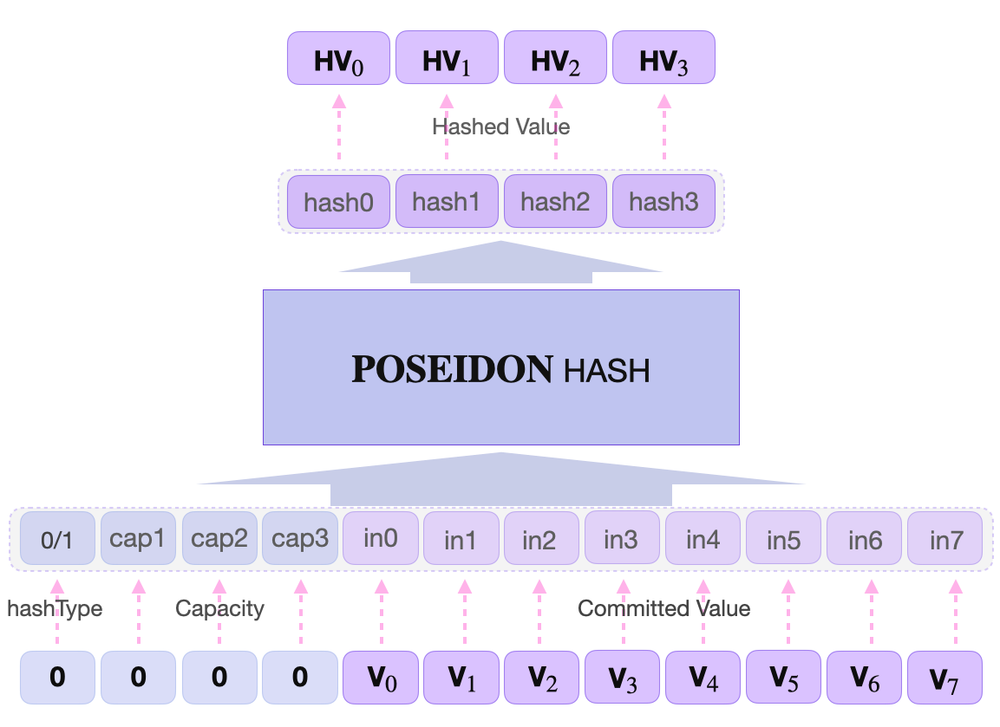

<b> Figure 16 : POSEIDON HASH0 </b>

In the case of the zkProver storage, two slightly different $\text{POSEIDON}$ hashes are used; $\text{HASH0}$ is used when a branch node is created, whilst $\text{HASH1}$ is used when a leaf node is created. This depends on the `hashType`, which is a boolean. So $\text{POSEIDON}$ acts as $\text{HASH1}$ when `hashType` = 1, and $\text{HASH0}$ when `hashType` = 0. 

Since POSEIDON Hashes outputs $4 * \lfloor(63.99)\rfloor \text{ bits} = 252$, and one bit is needed to encode each direction, the tree can have a maximum of 252 levels.