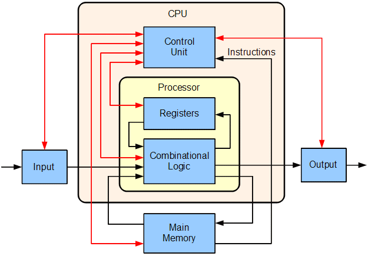
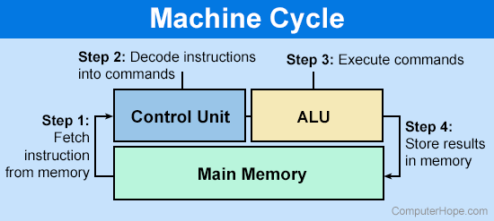
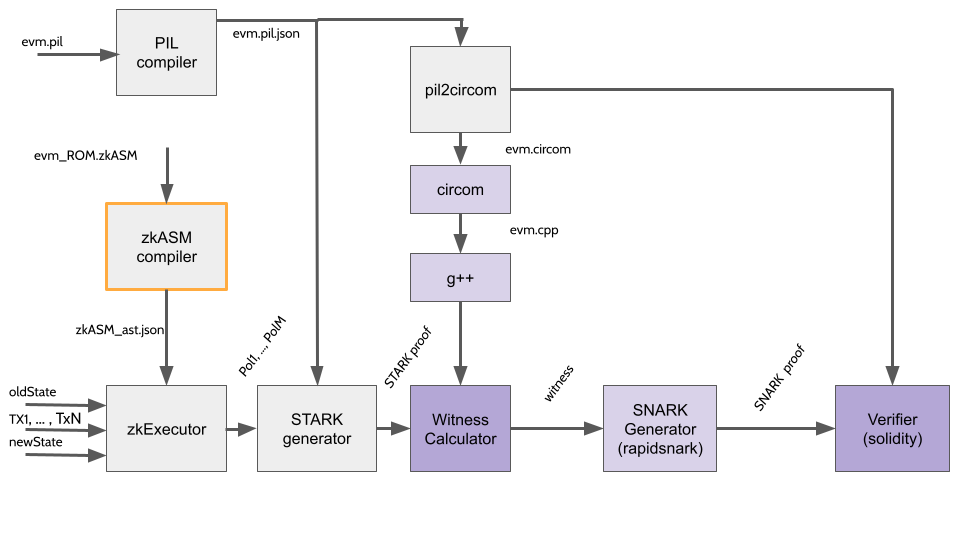

# zkASM: Zero-Knowledge Assembly Language

<!-- TODO: I assume that a knowledge about registers and the basic stuff has been explained in another document has been done

Suppose we are giving a state machine with a set of registers 
\[
\{\text{A}, \text{B}, \dots \},
\]
a set of defined ROM instructions between them
\[
\{\text{INS1}, \text{INS2}, \text{INS3}, \dots, \mathbf{FREE} \},
\]
and a set of methods implemented in the executor, to be load into the registers as free inputs
\[
\{\text{ExecutorMethod()}, \dots \}.
\]
Recall that registers are, in fact, composed of $4$ columns. Hence, for instance, $A$ can be decomposed as four columns $A_0, A_1, A_2, A_3$, where $A_0$ represents the less significative bits of $A$ and similarly, represents $A_3$ the most significative bits of $A$. 


  Hence, it consists on two rows of the resulting table.

  \begin{figure}[H]
      \centering
      \begin{tabular}{| c | c | c | c | c | c | c | c |}
          \hline
          \textbf{FREE0} & \textbf{FREE1} & \textbf{FREE2} & \textbf{FREE3} & $A_0$ & $A_1$ & $A_2$ & $A_3$ \\
          \hline
          0000           & 0000           & 0101           & 0111           & 0000  & 0000  & 0000  & 0000  \\
          0000           & 0000           & 0101           & 0111           & 0000  & 0000  & 0101  & 0111  \\
          \hline
      \end{tabular}
  \end{figure} -->

## Introduction

Ethereum is a state machine that transition from an old state to a new state by reading a series of transactions. It is a natural choice, in order to interpret the set of EVM opcodes, to design another state machine as for the interpreter. One should think of it as building a state machine inside another state machine, or more concretely, building an Ethereum inside the Ethereum itself. The distinction here is that the former contains a virtual machine, the zkEVM, that is zero-knowledge friendly.

### The zkEVM as a Microprocessor

Following the previous discussion, it is good to see the outer state machine as a microprocessor. What we have done is creating a microprocessor, composed by a series of assembly instructions and its associate program (i.e., the ROM) running on top of it, that interprets the EVM opcodes.


<div align="center"><b> Figure 1: Block diagram of a basic uniprocessor-CPU computer. Black lines indicate data flow, whereas red lines indicate control flow; arrows indicate flow directions. </b></div>

As in input, the microprocessor will take the transactions that we want to process and the old state. After fetching the input, the ROM is used to interpret the transactions and generate a new state (the output) from them.


<div align="center"><b> Figure 2: Block diagram of a basic machine cycle. </b></div>

### The Role of the zkASM

The zero-knowledge Assembly (zkASM) is the language used to describe, in a more abstract way, the ROM of our processor. Specifically, this ROM will tell the Executor how to interpret the distinct types of transactions that it could possibly receive as an input. From this point, the Executor will be capable of generating a set of polynomials will describe the state transition and will be later on used by the STARK generator to generate a prove of correctness of this transition.


<div align="center"><b> Figure 3: Big picture of the Prover in the zkEVM project, with focus in the zkASM part. </b></div>

## Basic Syntax

This section is devoted to explain the basic syntax of zkASM from a high-level point of view. Advanced syntax is totally dependendant of the use case (e.g. the design of a zkEVM) and will be explained in more detail with more complete examples in a latter section.

It is important to remark that each instruction of the zkASM is executed sequentially (the exception being the execution of a jump) one after the other. Instructions are depicted line by line and are divided in two parts. The left side part includes the part of the code that is actually gets executed in the corresponding file, while the right part is related to the execution of opcodes, jumps and subrutines, which is indicated by the colon "$:$" symbol.

### Comments and Modules

Comments are made with the semicolon "$;$" symbol.

```
; This a totally useful comment
```

At this moment, only one-line comments are available.

One can subdivide the zkASM code into multiple files and import code with the `INCLUDE` keyword. This is what we refer to as the **modularity** of the zkASM.

```
; File: main.zkasm

INCLUDE "utils.zkasm"
INCLUDE "constants.zkasm"
; -- code --
```

### Storing Values on Registers

There are many ways in which values can be stored into registers:

1. Assign a constant into one or more registers is made using the arrow operator "=>".

```
0 => A,B
```

2. Similarly, we can store the value of a register into other registers.

```
A => B,C
```

More generally, we can store the value of a function $f$ of registers.

```
f(A,B) => C,D
```

3. We can also store a global variable into some register.

```
%GLOBAL_VAR => A,B
```

4. The result of executing an executor method can also be stored into one or more registers. The indication of such an execution is done with the dollar "$" sign, which should be treated as a free input.

```
${ExecutorMethod(params)} => A,B
```

Notice that the method `ExecutorMethod` does not necessarily depends on the registers. An good example of such a method is `SHA256`.

5. If a method gets executed (with the dollar sign) by its own, its main purpose is generating log information.

```
${ExecutorMethod(params)}
```

6. Apart from executor methods, one can also use inline functions. This functions, which are also instantiated by the executor, are simply "short" and non-reused executor methods.

```
${A >> 2} => B
${A & 0x03} => C
```

### Introducing Opcodes

Until this point, every instruction consisted in a direct interaction with the registers. Now, we move one step forward and we obtain interaction with other parts of the ROM thank to the introduction of the zkEVM opcodes.

To assign the output of a zkEVM opcode into some register we use the following syntax:

```
$ => A,B    :OPCODE(param)
```

A clear example of such situation is when using the memory load opcode:

```
$ => A,B    :MLOAD(param)
```

When a registers appear at the side of an opcode, it is typically used to indicate that the value of the register `A` is the input of the memory store opcode:

```
A   :MSTORE(param)
```

Similarly, we can assign a free input into a register and later on execute several zkEVM opcodes using the following syntax:

```
${ExecutorMethod(params)} => A      :OPCODE1
                                    :OPCODE2
                                    :OPCODE3
                                    ...
```

When a executor method with a register to store its result gets combined with a jump opcode is typically to handle some unexpected situation, such as running out of gas:

```
${ExecutorMethod(params)} => A :JMP(param)
```

It is also typicall to encounter negative jumps to check appropiate situations in which carry on forthcoming operations:

```
SP - 2  :JMPN(stackUnderflow)
```

### Code Injection

Inline javascript-based instruction can be injected in plain by using the doble dollar "$" symbol.

```
$${CODE}
```

The main difference between the single dollar sign and the doble dollar sign is that while the methods inside the single dollar sign come from the Executor, the doble dollar ones do not: its is plain javascript code that is executed by the ROM.

### Asserts

Asserts work by comparing what is being asserting with what the value on register `A`. So, for instance, the following instructions compares the value inside register `B` with the value inside register `A`:

```
B    :ASSERT
```

## Some Complete Examples

Let's take the EVM ADD opcode as our first introductional example:

```
opADD:
    SP - 2          :JMPN(stackUnderflow)
    SP - 1 => SP
    $ => A          :MLOAD(SP--)
    $ => C          :MLOAD(SP)

    ; Add operation with Arith
    A               :MSTORE(arithA)
    C               :MSTORE(arithB)
                    :CALL(addARITH)
    $ => E          :MLOAD(arithRes1)
    E               :MSTORE(SP++)
    1024 - SP       :JMPN(stackOverflow)
    GAS-3 => GAS    :JMPN(outOfGas)
                    :JMP(readCode)
```

Let us explain in detail how the ADD opcode gets interpreted by us. Recall that at the beginning the stack pointer is pointing to the next "empty" address in the stack:

1. First, we check if the stack is filled "properly" in order to carry on the ADD operation. This means that, as the ADD opcode needs two elements to operate, it is checked that these two elements are actually in the stack:

```
SP - 2          :JMPN(stackUnderflow)
```

If less than two elements are present, then the `stackUnderflow` function gets executed.

2. Next, we move the stack pointer to the first operand, load its value and place the result in the `A` register. Similarly, we move the stack pointer to the next operated, load its value and place the result in the `C` register.

```
SP - 1 => SP
$ => A          :MLOAD(SP--)
$ => C          :MLOAD(SP)
```

3. Now its when the operation takes place. We perform the addition operation by storing the value of the registers `A` and `C` into the variables `arithA` and `arithB` and then we call the subrutine `addARITH` that is the one in charge of actually performing the addition.

```
A               :MSTORE(arithA)
C               :MSTORE(arithB)
                :CALL(addARITH)
$ => E          :MLOAD(arithRes1)
E               :MSTORE(SP++)
```

Finally, the result of the addition gets placed into the register `E` and the corresponding value gets placed into the stack pointer location; moving it forward afterwise. 

4. A bunch of checks are performed. It is first checked that after the operation the stack is not full and then that we do not run out of gas.
```
1024 - SP       :JMPN(stackOverflow)
GAS-3 => GAS    :JMPN(outOfGas)
                :JMP(readCode)
```
Last but not least, there is an instruction indicating to move forward to the next intruction.
